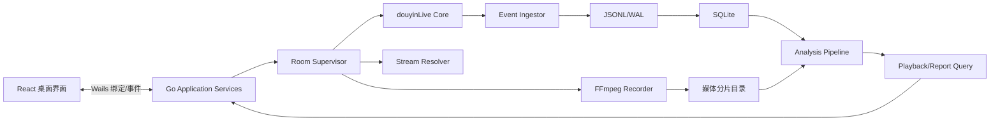

# 抖音直播间分析桌面程序总开发计划

> 文档状态：执行基线 0.2
> 适用代码基线：`b0aba16` 及其后续兼容版本
> 首发平台：Windows 10/11 x64
> 关联文档：[桌面 UI](01-desktop-ui-development-plan.md) · [采集与录制](02-capture-and-recording-development-plan.md) · [数据与分析](03-data-and-analysis-development-plan.md) · [工程与发布](04-engineering-testing-and-release-plan.md)

## 0. 项目进度与新会话接续入口

本节是项目进度的唯一事实来源。每次开发开始前先读取本节，每次开发结束前必须回写本节。用户在新的 Codex 会话中只需要输入：

```text
继续开发
```

智能体就应按“0.6 新会话接续协议”检查 Windows 权威工作副本，并从当前任务继续。用户不需要重新粘贴历史对话、架构方案或任务清单。

### 0.1 可机器读取的进度快照

<!-- DEVELOPMENT_PROGRESS_START -->

```yaml
schema_version: 1
updated_at: "2026-07-21T21:26:00+08:00"
authoritative_workspace: "GJS-20250801EFK:D:\\douyinLive"
last_verified_branch: "main"
last_verified_head: "455ff8d898117677575e0b50f253a19aa8689e95"
project_status: "IN_PROGRESS"
overall_completion_percent: 76
current_phase: "PHASE-4-PLAYBACK-ANALYSIS"
current_task: "P4-ANA-001"
next_task: "P4-ASR-001"
expected_dirty_paths:
  - "docs/00-master-development-plan.md"
  - "docs/01-desktop-ui-development-plan.md"
  - "docs/02-capture-and-recording-development-plan.md"
  - "docs/03-data-and-analysis-development-plan.md"
  - "docs/04-engineering-testing-and-release-plan.md"
  - "docs/development-progress-history.md"
  - "docs/validation/2026-07-21-p3-acceptance-closeout.md"
  - "docs/validation/2026-07-21-p4-playback-foundation.md"
  - "cmd/desktop/"
  - "cmd/p3acclauncher/"
  - "cmd/p3accproxy/"
  - "frontend/"
  - "http_context.go"
  - "http_context_test.go"
  - "internal/app/"
  - "internal/capture/"
  - "internal/diagnostics/"
  - "internal/eventstore/"
  - "internal/playback/"
  - "internal/room/"
  - "internal/storage/"
  - "logging.go"
  - "logging_privacy_test.go"
  - "scripts/"
blockers: []
last_completed_task: "P4-PLY-001"
last_completion_evidence: "历史场次列表/详情、分页事件/缺口/媒体、统一可交互时间轴与同步定位已接入 React；动态媒体端点只接受 opaque artifact ID，逐请求复核直放资格、内部/外部根身份、路径 containment、常规文件身份、大小和 SHA-256，并以 Windows 非共享写/删句柄覆盖 Range 服务期。playback 与外部根重点回归各 20 轮、前端 8 文件 23 测试、typecheck/build、全量 Go test/vet/build、Wails production build 与 diff-check 通过。"
resume_instruction: "执行 P4-ANA-001：实现版本化 10 秒指标桶、峰值/低谷与高光候选，使用固定事件集 golden test，并保持缺口和算法版本可追溯。"
```

<!-- DEVELOPMENT_PROGRESS_END -->

编辑规则：保留起止注释和字段名；字符串加引号；时间使用带时区的 ISO 8601；完成度使用 0–100 整数。智能体可自动更新字段，但不得删除未知的新字段。

### 0.2 状态定义

| 状态 | 含义 | 接续行为 |
| --- | --- | --- |
| `NOT_STARTED` | 尚未开始，依赖可能未满足 | 找到依赖已完成的最早任务后开始 |
| `READY` | 依赖已满足，可立即执行 | 设为 `IN_PROGRESS` 后实施 |
| `IN_PROGRESS` | 已产生未完成工作 | 先检查工作树和证据，再继续，禁止重复重做 |
| `BLOCKED` | 存在必须由环境或用户解除的阻塞 | 每次接续先低成本复查；仍阻塞则报告，不擅自扩权 |
| `DONE` | 交付物与验收证据均已完成 | 不重复实施；进入下一个 `READY` 任务 |
| `DEFERRED` | 明确移出当前版本 | 跳过，并保留原因和恢复条件 |

项目状态取当前关键路径中最高优先级任务的状态。任务只有在文件、测试、构建或人工验收证据写入任务表后才能标记 `DONE`；“代码已写但未验证”最多标记 `IN_PROGRESS`。

### 0.3 总体完成度

总体完成度采用阶段权重计算，不按主观工时估算：

```text
总体完成度 = Σ（阶段权重 × 阶段已完成任务点 / 阶段总任务点）
```

| 阶段 | 权重 | 状态 | 阶段完成度 | 已完成提示 | 下一退出条件 |
| --- | ---: | --- | ---: | --- | --- |
| PHASE-0 文档与决策基线 | 5% | `DONE` | 100% | 五份计划已创建并校验 | 计划变更持续同步 |
| PHASE-1 直播流解析验证 | 15% | `DONE` | 100% | 12/12 点完成；真实在线房间解析、媒体探测与短时流拷贝通过 | 真实平台字段变化时补充回归 |
| PHASE-2 Wails 桌面壳与房间管理 | 20% | `DONE` | 100% | 桌面壳、数据基础、房间设置、监控状态机、基础页面及真实 GUI 验收完成 | 平台或 WebView2 行为变化时复验 |
| PHASE-3 采集与录制 MVP | 30% | `DONE` | 100% | 30/30 点完成；稳定窗口、FFmpeg/网络故障恢复和人工停止收尾已按 2026-07-21 项目级豁免记录关闭 | 真实平台或工具链变化时复验；正式控制器合同保持严格 |
| PHASE-4 回放与基础分析 | 20% | `IN_PROGRESS` | 30% | P4-PLY-001 的历史查询、同步回放 UI 与安全媒体 Range 已完成（6/20 点） | 实现 10 秒指标桶、峰值/低谷与高光候选 |
| PHASE-5 发布与稳定性 | 10% | `NOT_STARTED` | 0% | — | 发布门禁、安装升级和 60 分钟稳定性通过 |
| **总体** | **100%** | **`IN_PROGRESS`** | **76%** | PHASE-0 至 PHASE-3 已关闭；P4 历史同步回放基础完成 | 执行 P4-ANA-001 基础指标与高光候选 |

完成度解释：0–10% 为规划与技术准备，11–30% 为采集和桌面基础，31–60% 为录制主链路，61–80% 为回放分析，81–99% 为发布加固，100% 仅在全部发布门禁通过后填写。

### 0.4 当前任务队列

任务按表格顺序执行；如需拆分新任务，使用同一阶段前缀并更新任务点。当前阶段 PHASE-4 总任务点为 20。

| ID | 任务 | 点数 | 依赖 | 状态 | 完成证据或阻塞 | 下一动作 |
| --- | --- | ---: | --- | --- | --- | --- |
| P0-DOC-001 | 建立五份详细开发计划 | 5 | 无 | `DONE` | `docs/00`–`04` 共 1527 行；结构校验通过 | 后续任务持续回写主文档 |
| P0-DOC-002 | 建立进度账本与新会话接续协议 | 0 | P0-DOC-001 | `DONE` | 主文档进度标记、完成度、任务队列与接续流程校验通过；`AGENTS.md` 已增加启动规则 | 每次开发结束前按 0.5 回写 |
| P1-ENV-001 | 验证 Go、FFmpeg 与 Wails 开发前置 | 1 | P0-DOC-001 | `DONE` | Go 1.26.4、Wails 2.13.0、Node 24.18.0、WebView2 150、FFmpeg 8.1.2、NSIS 3.12 可用；`wails doctor`、`go test ./...`、`go build ./...`、H.264/AAC 冒烟通过 | 保持版本锁定；升级单独验证 |
| P1-STR-001 | 从 `doRequest.example.json` 提取脱敏最小流样本 | 2 | P1-ENV-001 | `DONE` | `testdata/stream_resolver` 含 3 份 JSON 与说明；结构、嵌套 JSON、`.invalid` 域名、无查询参数和敏感标记守卫测试通过 | fixture 随平台字段变化持续补充 |
| P1-STR-002 | 实现纯函数流候选解析与标准化 | 4 | P1-STR-001 | `DONE` | `stream_resolver.go` 与表驱动测试覆盖直接 FLV/HLS、SDK、pull_datas、additional/web fallback、标准化、去重、稳定 ID 和脱敏错误；`go test ./...`、`go vet ./...`、`go build ./...` 通过 | 由公共接口复用纯函数，不在日志/UI 暴露 URL |
| P1-STR-003 | 新增 `ResolveStreams` 最小公共接口 | 2 | P1-STR-002 | `DONE` | 新增 `ResolvedStream` 与 `ResolveStreams`；复用同一实例 `fetchRoomEnterData` 并加上下文串行保护；URL/SourcePath 不进入 JSON，字符串输出脱敏；完整测试、vet、build 与 `cmd/main` 兼容门禁通过 | 由选择器消费公共 DTO，URL 只在 Go 内部传递 |
| P1-STR-004 | 完成自动选择、降级与错误分类测试 | 2 | P1-STR-003 | `DONE` | 候选按质量、兼容编码、协议和码率排序；覆盖 H.264/H.265-only、FLV/HLS 降级、缺失字段、已知码率优先及 403/404/410 分类；完整 test、vet、build 和 `cmd/main` 兼容门禁通过 | 由后续录制器按序尝试，每个候选最多一次 |
| P1-VAL-001 | 用户授权直播间短时技术验证 | 1 | P1-STR-004、FFmpeg 可用 | `DONE` | [脱敏验证记录](validation/2026-07-17-phase-1-stream-validation.md)：在线状态、26 个候选、FLV/H.264/AAC 探测、8 秒流拷贝和地址刷新行为均验证通过 | 平台字段变化时用同一隐私边界复验 |
| P2-WAILS-001 | 建立 Wails v2 桌面壳与前端工程 | 4 | P1-VAL-001 | `DONE` | `cmd/desktop`、`internal/app`、`frontend` 与生成绑定已建立；前端 typecheck/Vitest/build、Go test/vet/build、原入口构建、Wails production build 和 GUI 启动检查通过 | 后续服务只经应用层门面绑定，保持启动 DTO 脱敏 |
| P2-DATA-001 | 建立数据目录、SQLite 迁移与结构化日志 | 4 | P2-WAILS-001 | `DONE` | 固定用户数据目录、SQLite Schema v1（8 张业务表）、事务迁移、WAL/外键/忙等待、完整性检查与一致备份、按日 JSONL/14 天保留/全面脱敏完成；全量 Go/前端/Wails 门禁及真实启动通过 | 由房间与设置服务复用存储层，不把密钥或完整流地址写入数据库/日志/UI |
| P2-ROOM-001 | 实现房间配置 CRUD 与设置服务 | 4 | P2-DATA-001 | `DONE` | 房间 CRUD、Live ID 与录制策略校验、UUIDv7、DPAPI Cookie 引用、原子设置文件和保存目录持久化完成；重启/重复/删除/Cookie 不回显测试、全量 Go/前端/Wails 门禁及真实 GUI 数据初始化通过 | 由监控服务消费已脱敏房间配置，Cookie 仅在 Go 内部按引用读取 |
| P2-MON-001 | 接入等待开播、启停与状态事件 | 4 | P2-ROOM-001 | `DONE` | 每房间串行监督器、持久化启停、离线轮询、上线监听、连接重检、启动恢复、8 房间上限、状态查询和 `room:status` 事件完成；重复状态机、全量 Go/前端/Wails 与真实 GUI 启动门禁通过 | 由基础页面消费状态 DTO 和事件，不向前端发送 Cookie、凭据引用或流 URL |
| P2-UI-001 | 实现总览、房间、设置与诊断基础页面 | 3 | P2-MON-001 | `DONE` | 四个基础页面、房间 CRUD/监控动作、设置表单、严格运行时 schema 与单例状态事件桥完成；4 项 Vitest、全量前端/Go/Wails 门禁及真实 GUI 截图通过 | 执行 P2-ACC-001 重启、CRUD 与关闭验收 |
| P2-ACC-001 | 完成重启持久化、CRUD 与关闭验收 | 1 | P2-UI-001 | `DONE` | [验收记录](validation/2026-07-17-phase-2-acceptance.md)：真实 GUI 三轮 CRUD、监控、设置及重启持久化通过；活动监控下 WM_CLOSE 61 ms 自然退出，三轮均小于 10 秒、退出码 0、无残留 | PHASE-2 完成；进入 P3-CAP-001 |
| P3-CAP-001 | 建立场次契约、仓储与监督器编排 | 6 | P2-ACC-001 | `DONE` | [验收记录](validation/2026-07-17-p3-cap-session-lifecycle.md)：Schema v2 双状态/CAS、单场次编排、manifest 耐久恢复、共享收尾与 UI 锁定完成；全量门禁、20 轮重复测试及故障注入通过 | 执行 P3-EVT-001 |
| P3-EVT-001 | 实现有界事件采集、spool、标准化、去重与批写 | 6 | P3-CAP-001 | `DONE` | [验收记录](validation/2026-07-17-p3-evt-durable-event-ingest.md)：Schema v3、双有界 FIFO、raw/WAL 双 Sync、原子批写、隐私/去重/礼物折叠、drop ledger 与双游标恢复完成；全量门禁及高风险 100 轮回归通过，终审无 P0/P1 | 执行 P3-REC-001 |
| P3-REC-001 | 实现 FFmpeg、流候选、Job Object 与进程控制 | 6 | P3-EVT-001 | `DONE` | [验收记录](validation/2026-07-17-p3-rec-ffmpeg-process-control.md)：完成安全依赖发现、候选刷新与降级、唯一 attempt 隔离、有界进度解析、独立进程生命周期、Windows Job Object fail-closed 控制、分级停止、异步退出协调和隐私守卫；全量门禁、重点 100 轮、capture 包 20 轮及真实 FFmpeg/ffprobe 验收通过，终审无 P0/P1 | 执行 P3-MEDIA-001 |
| P3-MEDIA-001 | 实现分片探测、清单、音频代理与收尾 | 4 | P3-REC-001 | `DONE` | [验收记录](validation/2026-07-19-p3-media-finalization.md)：Schema v4、内外部录制根、URL-free attempt、数据包级探测、MKV 原子定稿、WAV/MP4 代理、`media.json` CAS、完成态篡改审计与持久化上界完成；全量 Go/P3/Wails/真实 FFmpeg E2E 通过，终审无 P0/P1 | 执行 P3-RCV-001 |
| P3-RCV-001 | 实现异常重试、缺口审计与启动恢复 | 4 | P3-MEDIA-001 | `DONE` | [验收记录](validation/2026-07-19-p3-rcv-recovery.md)：Schema v5、全局实例租约、严格分页、Global Job 证据恢复、媒体/事件恢复、原子缺口与终态推进、运行期有界退避及 fail-closed 启动完成；全量 Go/前端/Wails 与重点 20 轮回归通过，终审 P0/P1/P2=0 | 执行 P3-UI-001 |
| P3-UI-001 | 实现实时弹幕、录制进度与缺口告警 | 2 | P3-RCV-001 | `DONE` | [验收记录](validation/2026-07-19-p3-ui-realtime-monitoring.md)：完成后端有界实时发布、录制进度、状态 revision 与前端单例事件桥、2,000 条虚拟时间线、筛选/指标/倒计时/告警；全量 Go/前端/Wails 和真实冷启动 GUI 11/11 通过，终审 P0/P1/P2=0 | 执行 P3-ACC-001 |
| P3-ACC-001 | 完成 10 分钟稳定性、故障注入与真实 GUI 验收 | 2 | P3-UI-001 | `DONE` | [关闭记录](validation/2026-07-21-p3-acceptance-closeout.md)：稳定窗口、FFmpeg 崩溃与 relay 网络故障恢复已证明；人工停止与 UI finalizing 为 USER_OBSERVED，自然下播等待和最终机器视觉 ACK 经用户明确豁免为 USER_WAIVED/NOT_RUN；没有伪造 controller PASS/passed=true | PHASE-3 完成；执行 P4-PLY-001 |
| P4-PLY-001 | 实现历史场次查询、统一时间轴与同步回放基础 | 6 | P3-ACC-001 | `DONE` | [验证记录](validation/2026-07-21-p4-playback-foundation.md)：Schema v6、只读 keyset 查询、隐私 DTO、统一定位、React 历史详情/同步时间线及安全动态 Range 完成；重点 20 轮、前端 23 测试、全量 Go/前端/Wails 门禁通过 | 执行 P4-ANA-001 |
| P4-ANA-001 | 实现 10 秒指标桶、峰值/低谷与高光候选 | 6 | P4-PLY-001 | `READY` | P4-PLY-001 已关闭，Schema v6 版本化 metric bucket 主键可用 | 实现 10 秒桶、峰谷与高光候选及 golden test |
| P4-ASR-001 | 实现 ASR 插件接口与未配置降级 | 2 | P4-ANA-001 | `NOT_STARTED` | — | 等待 P4-ANA-001 |
| P4-EXP-001 | 实现 CSV/JSON 报告导出与隐私门禁 | 4 | P4-ANA-001 | `NOT_STARTED` | — | 等待 P4-ANA-001 |
| P4-ACC-001 | 完成回放、分析、ASR 降级与导出验收 | 2 | P4-ASR-001、P4-EXP-001 | `NOT_STARTED` | — | 等待 P4-ASR-001 与 P4-EXP-001 |

阶段任务点按当前阶段统计：P1 共 12 点且已完成；P2 共 20 点且已完成；P3 共 30 点且已完成；P4 共 20 点。上表若新增或调整点数，必须同步修正本句和对应阶段完成度。P0 的 5 点只用于记录文档基线。

### 0.5 完成度回写规则

每次开发任务结束前，智能体必须在同一个 Windows 工作副本中更新：

1. 进度快照的 `updated_at`、`project_status`、总体完成度、当前/下一任务、阻塞和最后完成证据。
2. 阶段表中的状态、阶段完成度、已完成提示和退出条件。
3. 任务表中本次任务的状态、证据和下一动作；存在部分实现时保持 `IN_PROGRESS`。
4. “0.7 接续日志”新增一行，包含日期、任务 ID、变更、验证和下一步。
5. `last_verified_branch/head` 和 `expected_dirty_paths`；不得假定脏文件都是智能体创建的。

完成证据至少包含以下一种：测试命令与结果、构建产物与版本、文件路径与结构校验、故障注入结果或用户明确验收。环境导致测试无法运行时必须写入阻塞，不能把“未运行”写成“通过”。

### 0.6 新会话接续协议

当用户仅输入“继续开发”“继续上次开发”或同义指令时，智能体必须直接执行以下流程：

1. 按项目 `AGENTS.md` 使用 `easy-memory`，但以 Windows 主计划的进度区为当前事实来源。
2. 通过 `ssh-windows-192-168-3-12` 读取 `D:\douyinLive\docs\00-master-development-plan.md` 全文，而不是只读摘要。
3. 在 `D:\douyinLive` 检查 `git status --short`、当前分支和 `git log -1 --oneline`，保护所有既有用户改动。
4. 读取 `current_task` 对应的子计划与相关源文件；不要重新执行已经有 `DONE` 证据的任务。
5. 若当前任务为 `BLOCKED`，先重新验证阻塞是否仍存在；未经用户授权不得安装工具、修改 PATH、提交、推送或做破坏性操作。
6. 若阻塞已解除，把任务改为 `IN_PROGRESS` 并继续；若当前任务为 `DONE`，选择依赖已满足的第一项 `READY/NOT_STARTED` 任务。
7. 实现、调试和验证均在 Windows 权威工作副本进行。测试不可用时明确记录原因和剩余风险。
8. 结束前按 0.5 回写进度快照、阶段表、任务表和接续日志，并用 `easy-memory` 记录可复用结论。

只有出现计划未覆盖且会显著改变产品范围/公共接口的选择，或需要新授权、外部凭据、安装系统工具、提交/推送等动作时，才暂停并询问用户。普通实现细节按计划中的默认决策继续，不要求用户重复确认。

### 0.7 接续日志

更早记录见[开发进度历史](development-progress-history.md)。PHASE-0 阶段总结：五份计划、机器可读进度账本与新会话接续协议均已建立并完成结构校验。

| 时间 | 任务 | 状态 | 变更与验证 | 下一步 |
| --- | --- | --- | --- | --- |
| 2026-07-16 19:44 | P1-STR-001 | `DONE` | 创建直连 FLV/HLS、SDK 嵌套 JSON、空流三份脱敏 fixture；结构与敏感信息守卫测试通过 | 执行 P1-STR-002 纯函数解析器 |
| 2026-07-16 19:44 | P1-STR-002 | `DONE` | 实现候选解析、标准化、去重、稳定脱敏 ID 与字段路径/长度错误；`go test ./...`、`go vet ./...`、`go build ./...` 和敏感扫描通过；`-race` 因当前无 CGO/GCC 未启动 | 执行 P1-STR-003 公共解析接口 |
| 2026-07-16 19:56 | P1-STR-003 | `DONE` | 新增公共 DTO 与解析入口，复用实例缓存和房间状态更新；URL/SourcePath 的 JSON 与字符串脱敏测试、完整测试、vet、build、`cmd/main` 兼容和敏感域扫描通过 | 执行 P1-STR-004 自动选择、降级与错误分类 |
| 2026-07-16 20:02 | P1-STR-004 | `DONE` | 实现自动排序、FLV→HLS 降级序列与脱敏错误分类；H.264/H.265、协议、码率、缺失字段、403/404/410 测试及完整 test、vet、build 门禁通过 | P1-VAL-001 等待用户授权直播间短时验证 |
| 2026-07-17 12:37 | P1-VAL-001 | `DONE` | 用户授权在线房间验证通过：26 个 FLV/HLS H.264 候选；ffprobe 为 FLV/H.264/AAC；FFmpeg 8 秒流拷贝通过；约 23 秒后地址刷新且旧/新地址均可读；记录不含房间标识或完整 URL | PHASE-1 完成，执行 P2-WAILS-001 |
| 2026-07-17 12:59 | P2-WAILS-001 | `DONE` | 建立 Wails v2.13.0 桌面入口、应用生命周期边界、React/TypeScript/Tailwind 界面壳和生成绑定；前端 typecheck、1 项组件测试、生产构建，Go test/vet/build、原入口构建、Wails Windows 构建及实际 GUI 启动均通过 | 执行 P2-DATA-001 数据目录、SQLite 迁移和结构化日志 |
| 2026-07-17 13:25 | P2-DATA-001 | `DONE` | 建立固定用户数据布局、纯 Go SQLite Schema v1 事务迁移、WAL/外键/连接约束、quick_check/一致备份及 JSONL 脱敏日志；目标与全量 Go/前端/Wails 门禁通过，真实启动生成数据库/WAL/日志，生产构建无用户目录副作用 | 执行 P2-ROOM-001 房间配置与设置 CRUD |
| 2026-07-17 13:53 | P2-ROOM-001 | `DONE` | 实现房间 CRUD、录制策略与保存目录持久化、UUIDv7、DPAPI Cookie 引用和原子设置文件；重启、重复、历史删除、Cookie 不回显测试及全量 Go/前端/Wails 门禁通过；真实 GUI 启动验证数据库、设置和日志，测试进程/数据/构建产物已清理 | 执行 P2-MON-001 等待开播、启停与 `room:status` 事件 |
| 2026-07-17 14:20 | P2-MON-001 | `DONE` | 实现串行房间监督器、等待开播、监控启停、连接重检、启动恢复、状态查询与 `room:status` Wails 事件；状态机 10 次重复测试和全量 Go/前端/Wails 门禁通过，真实 GUI 启动通过；跨计划任务 `CloseMainWindow` 无法发现 Wails 窗口，已记录为 P2-ACC 使用可靠退出入口复验，验证残留已清理 | 执行 P2-UI-001 总览、直播间、设置与诊断基础页面 |
| 2026-07-17 14:45 | P2-UI-001 | `DONE` | 实现总览、直播间、设置和诊断基础页面，完成房间新增/编辑/删除、Cookie 不回显、监控启停与实时 `room:status`；严格 Zod schema、4 项 Vitest、前端生产构建、全量 Go test/vet/build、`cmd/main`、Wails Windows 构建和无阻挡真实 GUI 截图通过，验证进程/数据/构建产物已清理 | 执行 P2-ACC-001 重启持久化、CRUD 与 10 秒优雅关闭验收 |
| 2026-07-17 15:02 | PLAN-TEST-DURATION | `DONE` | 按用户决策将录制变更门禁从 2 小时缩短为 10 分钟、候选发布稳定性改为 30 分钟、正式发布稳定性改为 60 分钟、实时 UI 连续测试改为 10 分钟，并同步提高采样频率、缩短资源重复次数 | 继续执行 P2-ACC-001 |
| 2026-07-17 15:57 | P2-ACC-001 | `DONE` | 隔离根内三轮真实 GUI 完成 CRUD、监控、设置和重启持久化；活动监控下及其余两轮 WM_CLOSE 均在 61 ms 内自然退出，退出码 0、无残留；全量 Go/前端/Wails 与普通生产 GUI 冒烟通过，验收数据和一次性任务已精确清理 | PHASE-2 完成，执行 P3-CAP-001 场次契约与仓储编排 |
| 2026-07-17 18:14 | P3-CAP-001 | `DONE` | 完成 Schema v2 双状态与 CAS、CaptureCoordinator/RoomSupervisor 单场次编排、manifest_dirty 耐久恢复和 STOPPING 共享收尾；全量 Go/前端/Wails 门禁、20 轮重复测试、129 条分页和故障注入通过；授权直播间当时离线，真实验收安全跳过且未冒充成功 | 执行 P3-EVT-001 有界事件持久化 |
| 2026-07-17 20:40 | P3-EVT-001 | `DONE` | 完成 Schema v3、有界 FIFO、raw/WAL 双 Sync、SQLite 原子批写、隐私去重、礼物折叠、drop ledger 与双游标 fail-closed 恢复；全量/20 轮/关键 100 轮、前端与 Wails 门禁通过，授权直播间离线安全跳过，终审无 P0/P1 | 执行 P3-REC-001 FFmpeg 与进程控制 |
| 2026-07-17 22:22 | P3-REC-001 | `DONE` | 完成 FFmpeg/ffprobe 安全发现、候选刷新降级、唯一 attempt 分片、受限进度解析、独立生命周期、Windows Job Object fail-closed 控制、分级停止和异步退出协调；全量 Go/前端/Wails、关键 100 轮、capture 包 20 轮及真实 FFmpeg/ffprobe 验收通过，授权直播间离线安全跳过，终审无 P0/P1 | 执行 P3-MEDIA-001 分片探测、媒体清单、音频代理与收尾 |
| 2026-07-19 17:51 | P3-MEDIA-001 | `DONE` | 完成 Schema v4、录制根身份与安全路径、URL-free attempt、分片和代理数据包级探测、MKV 原子定稿、WAV/MP4、`media.json` CAS、完成态篡改审计及基数/清单上界；修复后全量 Go/P3/前端/Wails、capture 20 轮、重点高风险回归与真实 FFmpeg 内外部根 E2E 通过，终审无 P0/P1；在线连通性已恢复，10 分钟授权房间验收仍按计划由 P3-ACC 执行 | 执行 P3-RCV-001 异常重试、缺口审计与启动恢复 |
| 2026-07-19 21:24 | P3-RCV-001 | `DONE` | 完成 Schema v5 恢复索引、数据根全局实例租约、固定截止严格 keyset 扫描、Global Job 进程恢复、媒体/事件耐久恢复、缺口和旧场次原子终态推进，以及 1/2/5/10 秒、最多 10 次或 5 分钟的运行期录制恢复；全量 Go test/vet/build、event source-tail/local-drop-gap 与关键跨进程/恢复测试 20 轮、前端 typecheck/Vitest/build、Wails 生产构建和 diff 门禁通过，终审 P0/P1/P2=0；无需直播间测试，在线 10 分钟与真实故障/下播留 P3-ACC | 执行 P3-UI-001 实时弹幕、录制进度与缺口告警 |
| 2026-07-19 23:49 | P3-UI-001 | `DONE` | 完成 SQLite 后置白名单事件批次、1 Hz 录制进度、全局状态 revision、前端单例桥、2,000 条虚拟时间线、六类筛选、指标、重试与缺口告警；全量 Go/P2/P3、前端 6 文件 20 项测试、Wails 生产构建及真实冷启动 GUI 11/11 通过，PrintWindow 与 JSON 一致，WM_CLOSE 54 ms 自然退出且零残留，终审 P0/P1/P2=0 | 执行 P3-ACC-001 十分钟在线稳定性、真实故障和下播验收 |
| 2026-07-21 17:38 | P3-ACC-001 | `DONE` | 正式运行证明十分钟稳定窗口、FFmpeg/relay 故障恢复、新 attempt 与 gap；后续收尾、媒体身份和日志隐私加固完成。用户明确批准人工停止并豁免自然下播等待与最终机器视觉 ACK，分别记录 USER_OBSERVED、USER_WAIVED/NOT_RUN，未声明 controller PASS；离线 14/14、清理竞态 2/2、五组 Go 矩阵、前端、PowerShell、Scheduled Task/MIC、cmd/main 与四产物构建通过 | PHASE-3 关闭；执行 P4-PLY-001 |
| 2026-07-21 18:06 | P4-PLY-001 | `IN_PROGRESS` | 完成 Schema v6：版本化 metric bucket 复合主键、session/event/gap keyset 索引、v5 一致备份与事务回滚；新增内部只读 playback repository，cursor 严格绑定版本、查询类型和规范化过滤，DTO 排除平台标识、路径、raw/normalized/details 等字段；storage/playback 20 轮、全量 Go test/vet/build 与 diff 门禁通过 | 实现媒体 segment/artifact 查询、统一时间轴映射和应用服务接入 |
| 2026-07-21 18:32 | P4-PLY-001 | `IN_PROGRESS` | 新增 path/root/attempt/SHA-free 媒体 segment+artifact keyset DTO，按 media epoch/PTS 生成统一时间轴，定位时应用 capture offset 并对重叠分片优先已审计 complete/recovered；仅来源摘要一致的 H.264 MP4 标记直放，否则明确降级 MKV/Gap。装配只读 PlaybackService 与 Wails 门面；目标包、playback 20 轮及全量 Go test/vet/build 通过 | 实现 React 历史场次列表/详情/同步时间线及动态媒体 Range 服务 |
| 2026-07-21 21:26 | P4-PLY-001 | `DONE` | React 历史场次/详情、分页同步事件/媒体/缺口与键盘时间轴完成；动态 Range 逐请求复核数据库直放资格、root marker/路径/卷身份、containment、常规文件身份/大小/SHA-256，并用 Windows 非共享写/删句柄冻结服务内容；重点 20 轮、前端 8 文件 23 测试、全量 Go/前端/Wails 门禁通过 | 执行 P4-ANA-001 10 秒指标桶、峰谷与高光候选 |

日志保留最近 20 条；更早记录移入单独的历史文档时，主文档保留链接和最后一条阶段总结。

## 1. 文档目的

本文是桌面程序建设的唯一主计划，负责锁定产品边界、总体架构、实施顺序、跨模块接口、验收口径和风险处理。四份子计划负责展开具体实现，不得改变本文中的产品边界和公共契约；需要变更时先修改本文并记录决策，再同步子计划。

项目要从“抖音直播消息抓取库及本地 WebSocket 转发服务”扩展为“可长期值守、自动录制、保存互动事件并分析直播效果的 Windows 桌面程序”。扩展必须保留原有 Go 库 API 和 `cmd/main` WebSocket 服务，已有使用方式不迁移、不降级。

## 2. 产品定位

### 2.1 目标用户

- 监听自己直播间的主播、运营人员和复盘人员。
- 希望把直播视频、音频、弹幕与互动数据放到同一时间轴上复盘的个人或小团队。
- 需要本地保存数据、不依赖持续在线云服务的用户。

### 2.2 核心用户旅程

1. 用户添加直播间标识并配置可选 Cookie、录制质量和保存目录。
2. 程序在后台等待开播；开播后自动建立消息连接、解析拉流地址并开始录制。
3. 直播中展示状态、录制时长、磁盘余量、实时弹幕和互动趋势。
4. 下播后程序收尾媒体文件、校验分片、聚合指标并生成场次记录。
5. 用户在历史场次中回放视频，查看同步弹幕、互动峰值、主播话术和高光候选。
6. 用户可导出统计、弹幕或诊断包，并按保留策略清理本地数据。

### 2.3 首版范围

- Windows 10/11 单机桌面应用，支持管理多个直播间配置。
- 多房间等待开播；默认仅允许一个房间同时录制，消息监听可并行。并发录制上限在设置中可提高，但必须经过磁盘与性能提示。
- 直播状态、弹幕、礼物、点赞、进场、关注等已支持消息的采集与标准化。
- FLV/HLS 地址解析、FFmpeg 分片录制、断线恢复、媒体清单和录制缺口记录。
- SQLite 索引、原始事件 JSONL/WAL、视频/音频文件和基础统计。
- 历史场次、媒体回放、同步事件时间线、基础分析与 CSV/JSON 导出。
- 本地诊断日志、健康检查和可脱敏导出的诊断包。

### 2.4 非目标

- 不承诺 100% 获取所有弹幕、礼物或平台业务消息。
- 不承诺获取曝光来源、个人观看时长、商品点击、订单转化等直播后台专属指标。
- 首版不提供云端账号体系、团队协作、远程控制、移动端或浏览器 SaaS。
- 首版不自动发布视频、不自动发送弹幕、不控制主播账号。
- 不重写现有抖音协议、签名、Cookie 和 WebSocket 连接链路。
- 高级大模型总结、跨场次智能建议不是首版发布门槛。

## 3. 当前基础与差距

### 3.1 可直接复用

- Go module：`github.com/jwwsjlm/douyinLive/v2`。
- `DouyinLive` 的开播检查、连接准备、保活、断线重连和生命周期控制。
- `SubscribeMessage`、`SubscribeMethod(s)`、`LiveMessage` 与 `ReceivedAt`。
- 当前 `cmd/main` 的多房间管理、未开播轮询和状态消息语义。
- 本地签名与可选 TikHub 签名配置。
- `doRequest.example.json` 中已经存在的 `stream_url`、FLV/HLS 和多清晰度样本。

### 3.2 必须新增

- 对直播流候选地址的安全解析与内部接口。
- 场次监督器、录制状态机和 FFmpeg 进程管理。
- 事件持久化、媒体清单、统一时间轴和缺口审计。
- SQLite 仓储、迁移、备份、保留策略和导出。
- Wails 桌面入口、Go 应用服务层、React 前端和设计系统。
- 基础统计、ASR 扩展接口、报告生成和回放查询。
- 桌面安装包、依赖检查、分钟级稳定性测试和诊断机制。

## 4. 技术选型决策

### 4.1 UI 引擎对比

| 方案 | 与现有 Go 集成 | UI 生态 | 包体/运行时 | 主要问题 | 结论 |
| --- | --- | --- | --- | --- | --- |
| Wails v2 | Go 方法直接绑定，可复用同一进程内的库 | React/TypeScript 生态成熟 | 使用系统 WebView2 | 依赖 Windows WebView2 | 采用 |
| Tauri v2 | 需要 Rust 壳与 Go Sidecar/IPC | 成熟 | 较轻 | 增加语言、进程和协议边界 | 不采用 |
| Electron | 需通过本地服务或 Node 原生桥接 Go | 最成熟 | Chromium 包体和内存较大 | 长期挂机资源成本较高 | 不采用 |
| Slint/egui | 需要 Rust 壳与 Go Sidecar/重写 | 原生工具型 UI 较好 | 较轻 | 数据看板、富文本和图表开发成本高 | 不采用 |

采用稳定的 Wails v2 系列，初始基线锁定 `v2.13.0`；Wails v3 在官方标记为稳定版之前不进入生产依赖。升级 Wails 次版本必须通过回归测试和安装包冒烟测试。

### 4.2 前端与数据技术

- 前端：React + TypeScript + Vite。
- 样式与组件：Tailwind CSS + shadcn/ui；图标统一使用 Lucide。
- 图表：Apache ECharts，按需加载图表类型。
- 前端服务端状态：TanStack Query；短生命周期 UI 状态：Zustand。
- 数据库：SQLite，使用 `database/sql` 和无 CGO 驱动；启动时执行显式版本迁移。
- 媒体：FFmpeg 独立进程，Go 使用参数数组启动，禁止拼接 Shell 命令。
- 日志：Go `slog` JSONL 文件 + UI 可查询的诊断摘要。

## 5. 总体架构



### 5.1 模块责任

| 模块 | 责任 | 不负责 |
| --- | --- | --- |
| `RoomService` | 房间配置、监控启停、运行状态 | 媒体进程细节 |
| `CaptureService` | 场次状态机、流解析、FFmpeg 管理 | UI 展示、分析算法 |
| `EventService` | 消息标准化、去重、缓冲和实时分发 | 长耗时分析 |
| `PlaybackService` | 历史场次、媒体清单、时间范围事件查询 | 修改原始数据 |
| `AnalysisService` | 指标聚合、ASR 任务、报告与导出 | 直播连接生命周期 |
| `SettingsService` | 配置、目录、隐私和依赖检查 | 保存明文敏感日志 |

UI 只能调用应用服务，不直接持有 `DouyinLive`、数据库连接或 FFmpeg 进程。服务间通过 Go 接口和不可变 DTO 交互；后台 goroutine 通过 `context.Context`、`errgroup` 和有界通道管理。

## 6. 跨模块公共契约

### 6.1 标识与时间

- `room_config_id`、`session_id`、`segment_id`、`event_id` 使用 UUIDv7 字符串。
- 数据库存储所有时间为 UTC Unix 毫秒；UI 按系统时区显示。
- 场次偏移 `session_offset_ms` 以媒体录制成功建立基准后的单调时钟计算。
- 文件名使用 UTC 时间和短 ID，不使用主播昵称，避免非法字符和隐私泄漏。

### 6.2 共享类型

- `RoomConfig`：房间标识、显示名称、监控开关、录制策略、Cookie 引用。
- `RoomRuntimeStatus`：状态、最近检查时间、错误码、重试时间、当前场次。
- `LiveSession`：场次起止、状态、媒体目录、时间轴校准与完整性。
- `LiveEvent`：方法、平台时间、接收时间、相对偏移、标准化数据和原始载荷引用。
- `StreamVariant`：不含签名 URL 的协议、清晰度、编码、码率和选中状态。
- `RecordingStatus`：状态、时长、分片、字节数、重启次数和最近错误。
- `MediaSegment`：序号、文件、起止、容器、编码、校验和与完整性。
- `AnalysisReport`：版本、指标、峰值、高光、问题和生成状态。
- `DiagnosticEvent`：级别、组件、错误码、摘要、场次与时间。

### 6.3 Wails 事件

| 事件 | 载荷 | 频率策略 |
| --- | --- | --- |
| `room:status` | `RoomRuntimeStatus`，含全局严格递增 `revision`、`operationId`、`sessionId`、`recordingStatus`、`retryAt`、稳定 `errorCode` | 状态更新立即发；前端只接受更大 revision，并从这一有序状态源派生重试、缺口与录制告警 |
| `live:event` | `LiveEventBatchDTO`：`sessionId`、`emittedAt` 与 1–100 条白名单 source 事件 | SQLite 提交成功后按场次发布；最多每 100 ms 或 100 条，UI 慢消费者只丢最佳努力副本 |
| `recording:progress` | `RecordingProgressDTO`：房间/场次/操作 fencing、录制状态、时长、字节、分片、帧率、速度和重启数 | 仅 `recording/reconnecting` 发布，最多每秒 1 次；旧场次、旧操作和旧 attempt 被拒绝 |
| `analysis:progress` | 任务 ID、阶段、百分比 | 最多每秒 2 次 |
| `analysis:completed` | 报告 ID、状态 | 完成或失败时一次 |
| `system:alert` | `DiagnosticEvent` | 保留给未来需要用户全局感知、且不属于单房间有序状态的告警 |

前端事件不得携带 Cookie、完整流 URL、`msToken`、`a_bogus`、签名或原始 Protobuf 二进制。

## 7. 五阶段实施路线

### 阶段 1：直播流解析技术验证

**目标**：确认当前 `web/enter` 响应可稳定解析可录制流，同时不破坏消息链路。

**主要任务**：

- 新增纯函数解析器及基于脱敏 fixture 的测试。
- 输出 FLV/HLS、清晰度、编码、码率和来源路径。
- 建立自动选择和降级规则。
- 用用户授权的直播间做短时手工验证，记录地址过期行为。

**交付物**：解析器、fixture、单元测试、技术验证记录。

**退出标准**：至少两类样本可获得候选流；日志无完整 URL；无候选时返回可诊断错误而非崩溃。

### 阶段 2：Wails 桌面壳与房间管理

**目标**：建立稳定桌面运行骨架和应用服务边界。

**主要任务**：

- 新增桌面入口和 `frontend/`，保留 `cmd/main`。
- 实现设置、房间 CRUD、等待开播和状态事件。
- 建立 SQLite 迁移、数据目录和结构化日志。
- 实现总览、房间管理、设置和诊断基础页面。

**交付物**：可启动桌面程序、房间配置持久化、状态看板。

**退出标准**：重启后配置保留；添加/删除/启停房间可用；关闭窗口能在超时内停止后台任务。

### 阶段 3：弹幕采集与媒体录制 MVP

**目标**：完成无人值守的开播自动录制闭环。

**主要任务**：

- 实现场次监督器、事件写入器和 FFmpeg 录制器。
- 保存媒体分片、音频代理、原始事件和媒体清单。
- 实现断线、流过期、FFmpeg 异常和突然下播恢复。
- UI 展示实时弹幕、录制进度和缺口告警。

**交付物**：可恢复录制、完整场次目录、实时监控页面。

**退出标准**：连续 10 分钟测试无未受控退出；断网和 FFmpeg 崩溃后按策略恢复；下播后场次正确收尾。

### 阶段 4：历史回放与基础分析

**目标**：让采集数据形成可复盘结果。

**主要任务**：

- 实现历史场次、播放器、同步事件和指标查询。
- 建立 10 秒指标桶、峰值/低谷和高光候选。
- 实现 ASR 插件接口及“未配置提供器”降级体验。
- 支持 CSV/JSON 报告导出。

**交付物**：历史回放、基础报告、导出功能。

**退出标准**：视频定位与事件时间线误差满足目标；报告可重复生成；无 ASR 时基础统计仍完整可用。

### 阶段 5：安装包、稳定性与正式发布

**目标**：形成可安装、可升级、可诊断的 Windows 产品。

**主要任务**：

- 固化依赖、许可证、FFmpeg 校验和和安装包流程。
- 完成分钟级稳定性、性能、恢复、升级和卸载测试。
- 实现脱敏诊断包、数据库备份和回滚说明。
- 完成用户文档和发布门禁。

**交付物**：签名安装包、发布说明、测试报告、SBOM/许可证清单。

**退出标准**：发布门禁全部通过，无 P0/P1 缺陷；升级保留数据；卸载默认不删除用户媒体且给出明确选项。

## 8. 需求追踪矩阵

| ID | 需求 | 负责计划 | 主要验收 |
| --- | --- | --- | --- |
| MON-001 | 未开播持续等待并自动切入直播 | 02 | 状态机与断线测试 |
| EVT-001 | 采集、标准化并保存互动消息 | 02、03 | fixture 与持久化测试 |
| REC-001 | 自动分片录制视频和音频 | 02 | 10 分钟录制与媒体探测 |
| REC-002 | 录制异常恢复和缺口审计 | 02、04 | 故障注入 |
| UI-001 | 房间、实时监控和录制状态 | 01 | UI E2E 与视觉验收 |
| PLY-001 | 历史回放与同步事件 | 01、03 | 时间轴误差测试 |
| ANA-001 | 基础指标、峰值和高光候选 | 03 | 固定数据集快照 |
| EXP-001 | CSV/JSON 导出与隐私处理 | 03 | 导出 schema 测试 |
| OPS-001 | 安装、升级、诊断和恢复 | 04 | 安装包矩阵 |
| CMP-001 | 保留 Go 库和 WebSocket 服务兼容 | 04 | 原有测试与接口冒烟 |

## 9. 非功能目标

- UI 空闲时 CPU 平均占用目标低于 2%；单房间监听无录制时内存目标低于 300 MiB。
- 单房间录制采用 stream copy 时，应用自身平均 CPU 目标低于 10%，不含平台解码预览。
- 实时事件进入 UI 的 P95 延迟目标低于 1 秒；磁盘批量落库 P95 低于 2 秒。
- UI 至少保留最近 2,000 条实时事件；历史数据按分页查询，不一次加载整场。
- 应用正常退出最长等待 10 秒；超时后记录未完成收尾并在下次启动恢复。
- 数据库、配置和报告必须可迁移；媒体文件不因数据库损坏而不可发现。

## 10. 关键风险与控制

| 风险 | 控制措施 |
| --- | --- |
| 平台字段变化 | 原始载荷留存、候选路径解析、fixture 回归、未知字段容忍 |
| 消息不完整 | 产品口径明确、断线区间与解析失败计数可见 |
| 流 URL 过期 | 录制失败分类、重新解析、指数退避和缺口记录 |
| 单文件损坏 | 10 分钟分片、工作容器优先 MKV、结束后校验/封装 |
| 磁盘耗尽 | 启动前阈值、持续监控、停止录制但继续低成本监听 |
| Cookie/签名泄漏 | 凭据引用、日志脱敏、UI 不暴露、诊断包二次过滤 |
| WebView2 差异 | Wails doctor、Windows 版本矩阵、安装包检测 |
| 长期运行资源泄漏 | 有界队列、上下文取消、goroutine/句柄基线与限时稳定性测试 |

## 11. 完成定义

一个功能只有同时满足以下条件才算完成：

- 实现与本文及子计划一致，公共接口已经记录。
- 正常路径、失败路径和恢复路径均有自动化测试或明确的人工测试记录。
- 日志不含敏感值，错误能映射为稳定错误码和用户可执行建议。
- 数据迁移、升级兼容和关闭行为已验证。
- 用户可从 UI 观察结果，不需要阅读开发日志才能判断状态。
- 相关文档、验收项和追踪矩阵已更新。

## 12. 术语

- **直播间标识（Live ID）**：用户输入的 `live.douyin.com/<id>` 路径标识。
- **房间 ID（Room ID）**：平台解析出的长房间 ID。
- **场次（Session）**：一次从确认开播到最终收尾的逻辑直播记录。
- **媒体分片（Segment）**：FFmpeg 输出的固定时长工作文件。
- **缺口（Gap）**：已知无法采集消息或媒体的时间区间。
- **平台时间**：消息载荷中的创建时间，存在且可信时使用。
- **接收时间**：本机收到 `LiveMessage` 的时间。
- **统一时间轴**：以场次基准把事件、媒体和转写映射到同一毫秒偏移。

## 13. 变更治理

- 影响产品范围、公共类型、Wails 事件、数据库 schema 或状态机的变更必须先更新本文。
- 仅实现细节变化可只更新对应子计划，但不得与本文冲突。
- 每份文档顶部维护状态和适用基线；重大决策以“日期、决策、理由、替代方案、影响”格式追加。
- 禁止把真实 Cookie、签名、主播隐私或仍有效的流 URL 写入文档、fixture、日志和提交历史。
- 2026-07-17，决策：将长耗时稳定性门禁改为 10/30/60 分钟分层验证；理由：避免 2/24/72 小时测试阻塞迭代；替代方案：保留原时长或仅在最终发布前执行，均不采用；影响：提高采样频率并保留恢复、资源趋势和缺口审计，后续发现分钟级测试无法暴露的问题时再按故障证据定向延长。
- 2026-07-17，决策：SQLite Schema v2 为 `live_sessions` 增加独立 `recording_status`、`operation_id` 与 `manifest_dirty`，保留现有场次 `status` 约束，并以 CAS 和部分唯一索引保证每房间最多一个活动场次；理由：消息场次可在录制禁用或无流时继续存在，异步旧结果不能覆盖较新状态，且数据库提交后即使进程崩溃也能发现未确认的文件镜像；替代方案：把 `unavailable` 塞入场次状态、仅以内存记录镜像失败或重建被多张表引用的父表，均不采用；影响：`status=recording` 在 v2 表示活动场次阶段，真实录制生命周期由 `recording_status` 表达；`session.json` 只有在同目录原子替换、健康日志 Sync 确认和精确版本 CAS 后才清除脏标记，启动时按页修复。
- 2026-07-17，决策：SQLite Schema v3 以场次 `ingest_sequence` 和双位置 checkpoint 为事件提交边界，单 FIFO 同时受条数与字节限制，先 raw binpack Sync、再 WAL Sync，最后在一个 SQLite 事务中提交 source/aggregate、礼物折叠、缺口和 checkpoint；理由：崩溃、数据库降级和高基数礼物下仍需可证明的顺序、幂等和内存上界；替代方案：source-only 推进 checkpoint、普通/紧急双队列、无限 deferred map、零值无限 spool 或只保护 WAL 游标，均不采用；影响：每场次 raw+WAL 默认上限 4 GiB，容量批次先验零写入，致命故障只审计未双 Sync 后缀，恢复只修复 checkpoint 之后可证明的最终崩溃尾，privacy key 不匹配或 WAL/raw 游标不一致时 fail closed。
- 2026-07-19，决策：SQLite Schema v4 以 `recording_roots`、`session_media`、扩展后的 `media_segments` 和 `media_artifacts` 作为媒体恢复事实源，并把外部根的 marker、卷身份、大小写无关 canonical key、URL-free attempt 日志、清单 revision/dirty CAS 与完成态文件证据持久化；理由：跨盘保存、崩溃重入、文件系统替换和数据库/`media.json` 双写必须可审计且不得覆盖既有媒体；替代方案：仅把绝对路径写入设置、扫描目录推断状态、复用旧 attempt、相信文件名或把完整 URL 写入日志，均不采用；影响：内部根的 `root_id` 为空，外部根每阶段 fail-closed 重验，单场次最多 128 attempts、4096 segments、8192 artifacts 和 128 MiB 清单，P3-RCV 必须基于这些耐久状态协调重试与缺口修复。
- 2026-07-19，决策：单房间录制异常、重试和恢复告警统一由带全局严格递增 `revision`、稳定 `errorCode` 与 `retryAt` 的 `room:status` 派生，不再另发 `recording:error`；理由：双事件源无法共享顺序，容易产生重复、倒序或旧操作告警，而房间状态已包含 session/operation fencing 与完整录制状态；替代方案：新增独立 `DiagnosticEvent` 或让前端合并两套时序，均不采用；影响：P3 前端只需单例监听 `room:status`、`live:event`、`recording:progress`，`system:alert` 仅保留给未来非房间级全局告警。
- 2026-07-21，决策：按用户明确指示以项目级例外关闭 P3-ACC；人工停止和 UI finalizing 记为 `USER_OBSERVED`，自然下播等待与最终机器视觉 ACK 记为 `USER_WAIVED/NOT_RUN`，不得声明控制器 `PASS` 或 `passed=true`；理由：十分钟稳定窗口、FFmpeg 崩溃和隔离 relay 网络故障恢复已取得真实证据，用户选择不再等待不可控的自然下播，并明确豁免最终视觉确认；替代方案：继续等待自然下播或放宽控制器成功合同，均不采用；影响：严格控制器合同和测试保持不变，豁免不形成任何自动成功分支，正式发布前仍可按原合同重新执行完整验收。
- 2026-07-21，决策：PHASE-4 固定为 P4-PLY-001（6 点）、P4-ANA-001（6 点）、P4-ASR-001（2 点）、P4-EXP-001（4 点）和 P4-ACC-001（2 点）；理由：回放查询与时间轴必须先于指标、ASR 和导出，且阶段权重 20% 与 20 点一一对应；替代方案：新增独立 P4-DATA 任务或把全部功能放入单一任务，均不采用；影响：Schema v6 与只读查询基础并入 P4-PLY-001，后续任务按依赖顺序实施。
