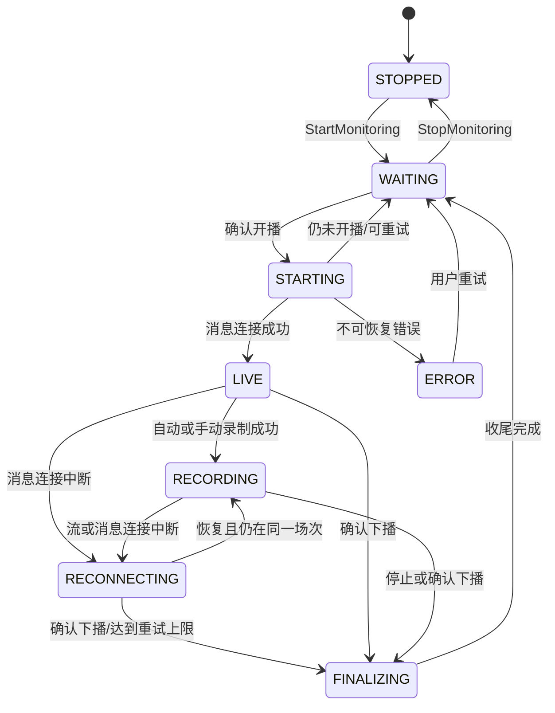

# 直播采集与录制开发计划

> 上级计划：[总开发计划](00-master-development-plan.md)
> 相关计划：[桌面 UI](01-desktop-ui-development-plan.md) · [数据与分析](03-data-and-analysis-development-plan.md) · [工程与发布](04-engineering-testing-and-release-plan.md)

## 1. 目标

本计划定义从“等待开播”到“场次完成”的完整采集链路：直接复用现有 `douyinLive` Go 核心，解析可录制直播流，管理 FFmpeg 分片，持久化互动事件，维护统一时间轴，并对所有已知中断形成可审计缺口。

首版成功标准不是“永不掉线”，而是“长期运行时状态可知、失败可恢复、数据缺口可见、退出可收尾”。

## 2. 现有能力复用与改动边界

### 2.1 直接复用

- `NewDouyinLiveWithSlog` / TikHub 构造器。
- `PrepareWebSocketContext`、`IsKnownOfflineStatus`、`Start`、`Close`、`Dispose`。
- `SubscribeMessage`、`Unsubscribe` 和 `LiveMessage.ReceivedAt`。
- 直播页与 `web/enter` 请求、Cookie、签名、重连和保活。
- 已有消息类型常量和 protobuf 解析。

### 2.2 对根库的最小新增公共能力

当前 `fetchRoomEnterData` 是非导出方法，桌面应用不能安全取得直播流。根包新增只用于业务集成的解析接口：

```go
type ResolvedStream struct {
    ID         string
    Protocol   string // "flv" | "hls"
    QualityKey string
    Quality    string
    Codec      string // "h264" | "h265" | "unknown"
    Bitrate    int64
    URL        string // 仅 Go 内部使用，禁止日志与 Wails 序列化
    SourcePath string
}

func (dl *DouyinLive) ResolveStreams() ([]ResolvedStream, error)
```

规则：

- 方法复用同一实例的 Cookie、签名和 HTTP 上下文，不另建不一致的抓取实现。
- 返回切片是当前时刻快照，调用方必须假定 URL 会过期。
- `ResolvedStream` 不作为 Wails 绑定类型；前端使用去掉 `URL`、`SourcePath` 的 `StreamVariant`。
- 解析函数拆为纯函数 `parseResolvedStreams(body string)`，使用脱敏 fixture 测试。
- 不改变现有构造器、订阅接口和 `cmd/main` 输出格式。

## 3. 模块设计

```text
internal/room/
  supervisor.go              # 房间长期状态机
internal/capture/
  session.go                 # 场次生命周期
  stream_resolver.go         # 选择与刷新
  recorder.go                # FFmpeg 进程
  segment_probe.go           # ffprobe 校验
  recovery.go                # 启动恢复
internal/eventstore/
  normalizer.go              # protobuf -> 标准事件
  spool.go                   # JSONL/WAL
  writer.go                  # SQLite 批写
  deduplicator.go            # 去重与礼物合并
```

每个房间由一个 `RoomSupervisor` 串行处理状态变化。直播连接、录制进程和事件写入可以并发，但只能通过监督器发出状态转换，避免两个 goroutine 同时创建场次或启动 FFmpeg。

## 4. 状态机

### 4.1 房间状态



### 4.2 转换约束

- `STARTING` 必须生成单次操作 ID，过期结果不得覆盖较新的状态。
- 只有收到可靠在线状态并成功建立直播上下文后才能创建 `LiveSession`。
- 消息连接成功但无可录制流时允许进入 `LIVE`，场次记录 `recording_status=unavailable`。
- 下播需要现有核心的连续状态确认；单次网络错误不能结束场次。
- `FINALIZING` 期间禁止创建同房间新场次；收尾超时则标记 `incomplete` 后返回 `WAITING`。
- 用户停止监控时，正在录制的场次仍先进入 `FINALIZING`，不能直接杀进程并丢弃清单。

### 4.3 场次持久化契约（Schema v2）

- `live_sessions.status` 继续使用 `starting/recording/finalizing/completed/interrupted/failed`；为避免重建被事件、媒体、转写、分析和缺口表共同引用的父表，v2 不改变原 CHECK。活动消息场次使用 `status=recording`，不等同于媒体一定正在写入。
- 新增 `recording_status`：`pending/disabled/starting/recording/unavailable/reconnecting/finalizing/completed/incomplete/failed`。关闭录制策略时为 `disabled`；消息连接有效但无可录制流或依赖不可用时为 `unavailable`，不得因此停止事件场次。
- 新增非敏感 `operation_id`。Open、Rebind、Finalize 每次生成新 ID；仓储更新同时 CAS 旧场次状态、旧录制状态和旧 operation ID，旧异步结果影响行数为 0 时返回稳定的过期操作错误。
- 建立 `status IN ('starting','recording','finalizing')` 的按房间部分唯一索引，作为单 worker 串行编排之外的数据库最终防线。`FINALIZING` 完成前不得为同一房间创建新场次。
- 场次路径固定为 `rooms/<room-config-id>/sessions/<yyyy>/<mm>/<session-id>`，数据库只保存相对数据根的 `/` 分隔路径。每次创建和状态转换都以临时文件、同步和同目录原子重命名更新 `session.json`；数据库是索引事实来源，文件镜像用于数据库损坏时重建。
- `manifest_dirty` 与场次主事务一同置为 1。文件成功落盘后必须先把脱敏 `CAPTURE_MANIFEST_REPAIR_CLEARED` 健康事件写入 JSONL 并完成 Sync，再以 `id + operation_id + status + recording_status + updated_at` 精确 CAS 清零；任何日志同步、清标或进程崩溃都保留脏标记，启动时按 128 条 keyset 分页只扫描脏记录和活动场次。
- 同一场次的读取修复、创建后提升和状态转换共用串行锁，并在写文件前重读数据库版本；`updated_at` 严格单调，避免旧 repair 或同毫秒转换覆盖新 manifest。批量启动修复每页只做一次健康日志 Sync，未清数量必须准确递减到 0。
- `RoomSupervisor` 仍是唯一房间状态机；`CaptureCoordinator` 只返回由 worker 持有的场次句柄并组合 Recorder/EventSink。外层连接中断进入 `RECONNECTING` 时保留句柄；下一次可靠在线执行 Rebind 并复用同一 `session_id`，只有确认下播、用户停止或应用退出才 Finalize。
- MonitorManager 与 Application 关闭均采用调用方无关的共享清理：调用方 context 只限制等待，不拥有清理；Application 进入 `STOPPING` 后立即摘除公共服务但保留原生命周期，等 Monitor/场次真正排空后再取消 context、关闭 SQLite 与日志。初始化在开始和提交两个位置拒绝 `STOPPING/STOPPED`，禁止超时关闭后的资源复活。

## 5. 流地址解析

### 5.1 候选字段顺序

解析器以容错方式遍历以下来源，不依赖数组固定索引：

1. `data.data[*].stream_url.flv_pull_url`
2. `data.data[*].stream_url.hls_pull_url_map`
3. `data.data[*].stream_url.hls_pull_url`
4. `data.data[*].stream_url.live_core_sdk_data.pull_data.stream_data`
5. `data.data[*].stream_url.pull_datas`
6. `data.data[*].additional_stream_url` 中对应字段
7. 顶层 `data.web_stream_url` 作为最后兜底

嵌套 JSON 字符串先执行严格 JSON 解码；解码失败记录字段路径和长度，不记录内容。未知字段忽略但保留 fixture 用于后续适配。

### 5.2 标准化

- 协议从字段来源和 URL scheme/path 双重判断。
- 清晰度 key 转为稳定标签：原画、蓝光、超清、高清、标清；无法识别则保留 `unknown:<key>`。
- 编码优先读取 SDK 元数据，其次从参数推断；不能确认时为 `unknown`。
- 使用规范化 URL 的非敏感部分生成候选 ID；禁止把 query 写入 ID、日志或数据库。
- 完全相同的协议、质量、编码和主机路径候选去重。

### 5.3 自动选择规则

用户设置包含 `quality_preference`、`protocol_preference` 和 `compatibility_mode`。

自动模式按以下顺序评分：

1. 满足用户指定质量；未指定则选择最高可用质量。
2. 兼容模式优先 H.264；只有 H.265 时允许录制但标记回放可能需转码。
3. 同质量下优先 FLV，失败后降级 HLS；用户明确指定协议时先尊重指定值。
4. 同一候选存在码率时选择最高正码率；未知码率排在已知码率之后。
5. 启动失败按评分依次尝试候选，每个候选最多一次，全部失败后重新解析而不是无限轮询旧 URL。

选择结果写入媒体清单，但只保存协议、质量、编码、码率和脱敏源标识，不保存完整 URL。

## 6. FFmpeg 进程管理

### 6.1 依赖发现

查找顺序：

1. 应用设置中的明确路径。
2. 安装包随附的受信任 `ffmpeg.exe` 和 `ffprobe.exe`。
3. 系统 `PATH`。

发现后执行 `-version`，记录版本、构建配置摘要和可执行文件 SHA-256。找不到 FFmpeg 时消息监听仍可用，录制返回 `FFMPEG_NOT_FOUND`。

### 6.2 启动安全

- 使用 `exec.CommandContext` 和独立参数数组，绝不调用 `cmd /c` 或拼接 Shell 字符串。
- 流 URL 只作为进程参数存在；日志显示 `<redacted-stream-url>`。
- Windows 下为进程配置 Job Object，确保应用异常退出后子进程不会永久遗留。
- 标准输出和标准错误进入有界环形缓冲；只把经过脱敏的末尾摘要写诊断日志。
- 每个启动分配 `recorder_attempt_id`，退出回调必须匹配当前 attempt 才能改变状态。

### 6.3 工作格式与分片

- 默认 `-c copy`，不在录制阶段重新编码。
- 工作容器为 MKV，默认每 600 秒一个分片；设置允许 300–1800 秒。
- 文件名：`segment-000001-<utc>.mkv`，先写 `.partial`，FFmpeg 正常关闭并通过探测后原子重命名。
- 场次结束后为 H.264/AAC 等兼容组合无损封装 MP4；不兼容组合保留 MKV 并生成代理 MP4 的待处理任务。
- 额外生成单声道 16 kHz PCM/WAV 或等价无损音频代理供 ASR；生成失败不判定原始录制失败。
- 每个分片完成后使用 ffprobe 记录容器、流、时长、首末时间戳和可读性。

### 6.4 停止顺序

1. 监督器标记 `FINALIZING`，停止接受新的录制启动。
2. 请求 FFmpeg 优雅结束并等待当前容器写尾。
3. 5 秒无响应时发送终止；再等 3 秒后强制结束并把分片标记为待恢复。
4. 探测全部分片、补全媒体清单、计算 SHA-256（可后台低优先级完成）。
5. 刷新事件写入器并关闭场次 spool。
6. 更新场次完整性、触发基础聚合和 UI 完成事件。

## 7. 录制恢复策略

### 7.1 失败分类

| 类别 | 示例 | 行为 |
| --- | --- | --- |
| 输入过期 | 403、404、立即 EOF | 重新解析流，1/2/5/10 秒退避 |
| 临时网络 | 超时、连接重置 | 先重试当前候选，再重新解析 |
| 不支持编码/容器 | FFmpeg 明确报错 | 尝试下一候选或兼容容器 |
| 本地资源 | 磁盘不足、无权限 | 停止录制，保持低成本监听并告警 |
| 依赖缺失 | 可执行文件不存在/损坏 | 禁止自动重试，要求用户修复 |
| 已下播 | 状态连续确认 | 进入 `FINALIZING` |

同一场次自动重启最多 10 次；连续失败窗口超过 5 分钟或重启达到上限后停止录制但继续消息监听。每次失败和恢复之间建立 `capture_gaps`。

### 7.2 应用启动恢复

- 扫描数据库中 `STARTING`、`RECORDING`、`FINALIZING` 的未完成场次。
- 检查对应 Job Object/进程是否仍存在；正常情况下旧进程应已终止。
- 探测 `.partial` 和未登记分片：可读则登记为 `recovered`，不可读则保留并标记 `corrupt`，不自动删除。
- 截止时间使用最后文件写入与最后事件接收时间的较大值。
- 将旧场次标记 `interrupted` 并完成基础聚合；如果房间仍开播，创建新场次，不复用旧 `session_id`。

## 8. 场次目录与清单

```text
data/
└── rooms/<room-config-id>/sessions/<yyyy>/<mm>/<session-id>/
    ├── session.json
    ├── events/
    │   ├── events-000001.jsonl
    │   └── raw-000001.binpack
    ├── media/
    │   ├── segment-000001-<utc>.mkv
    │   └── playback-000001.mp4
    ├── audio/
    │   └── asr-000001.wav
    ├── manifests/
    │   ├── media.json
    │   └── gaps.json
    └── reports/
```

`session.json` 只保存非敏感元数据和 schema 版本，可在数据库损坏时重建索引。所有路径在数据库中保存为相对数据根目录的 `/` 分隔路径；操作系统访问时统一由路径服务转换和校验。

## 9. 事件采集

### 9.1 回调约束

`SubscribeMessage` 回调只执行：

1. 捕获 `ReceivedAt`、方法、房间元数据和原始 payload 副本。
2. 生成内部 `IngestEnvelope`。
3. 尝试写入有界高优先级通道。

回调中禁止数据库查询、FFmpeg 调用、网络请求和分析。通道满时优先写紧急 spool；紧急 spool 失败必须累计 `EVENT_DROPPED_LOCAL` 并发出严重告警。

### 9.2 标准化与原始数据

- `LiveEvent` 保存常用字段；原始 protobuf 保存到按块压缩的 binpack，并通过 offset/length 引用。
- protobuf 解析失败或未知 method 仍保存原始数据和失败原因。
- 用户标识进入标准表前使用安装级盐进行 HMAC-SHA256；昵称作为可配置隐私字段。
- 内容字段做长度上限和 UTF-8 修复，原始载荷不修改。

### 9.3 去重与礼物连击

- 优先使用平台 message ID 去重。
- 无 ID 时使用 `room_id + method + platform_time + payload_hash`，只在短时间窗口去重。
- 去重缓存有容量和 TTL 上限，数据库对 `(session_id, dedupe_key)` 建唯一约束作为最后防线。
- 礼物连击按平台 `group_id`/重复 ID/结束标志维护聚合；原始消息全部保留，标准事件另写合并结果。

## 10. 时间轴与缺口

- `received_at` 使用 UTC 墙钟；同时在进程内捕获单调时间用于偏移计算。
- `message_create_at` 仅在字段存在、单位可识别且不偏离接收时间超过合理阈值时标记可信。
- `session_offset_ms` 默认基于场次媒体基准；无媒体时基于确认开播时间并标记 `clock_source=received`。
- 分片记录 FFmpeg 启动墙钟、首 PTS、末 PTS 和探测时长。
- 可选校准标记通过固定弹幕与 ASR 短语估算 `capture_offset_ms`，只作为后处理校准，不覆盖原始时间。

缺口类型：`message_disconnect`、`recording_restart`、`stream_unavailable`、`disk_full`、`process_crash`、`clock_uncertain`。缺口必须有开始、结束、来源、严重度和是否恢复；开放缺口在收尾时关闭或标记未知结束。

## 11. 资源与并发控制

- 默认最多 8 个等待/消息监听房间、1 个录制房间、1 个 ASR/分析任务。
- 设置可调上限，但录制并发超过 1 时显示磁盘带宽和空间风险。
- 事件通道、FFmpeg 日志、UI 批次和分析队列全部有界。
- 每房间一个根 context；场次、录制器和写入器为子 context。
- 停止顺序由监督器统一管理，任何子组件不得关闭不属于自己的通道。

## 12. 测试计划

### 12.1 解析器

- 覆盖 `doRequest.example.json` 中各类 FLV/HLS、SDK 嵌套 JSON、附加流和空流。
- 字段缺失、类型变化、无效 JSON、重复候选、H.265-only 和未知质量。
- fixture 必须脱敏 query；测试断言不得输出完整 URL。

### 12.2 状态机

- 未开播 → 开播 → 录制 → 下播 → 等待。
- 连接中断但仍开播、重复在线通知、启动结果过期和用户并发点击。
- 停止监控、退出程序、收尾超时和启动恢复。
- 用模型/表驱动测试验证不存在非法转换和双场次。

### 12.3 FFmpeg 与恢复

- 使用本地生成的短测试流验证分片、优雅停止、探测和封装。
- 注入 403、EOF、进程崩溃、磁盘写失败和 ffprobe 失败。
- 校验进程参数脱敏、Job Object 清理和 `.partial` 恢复。
- 10 分钟稳定性测试统计 goroutine、句柄、内存、分片连续性和事件延迟。

### 12.4 验收

- 开播后在目标时间内建立消息连接并开始录制。
- 网络恢复后自动创建新分片并记录准确缺口。
- 下播后数据库、`session.json`、媒体清单和 UI 状态一致。
- 任何失败均不导致 Cookie 或完整流 URL进入日志、UI或诊断包。
- 原有 Go 单元测试和 `cmd/main` WebSocket 冒烟测试继续通过。
