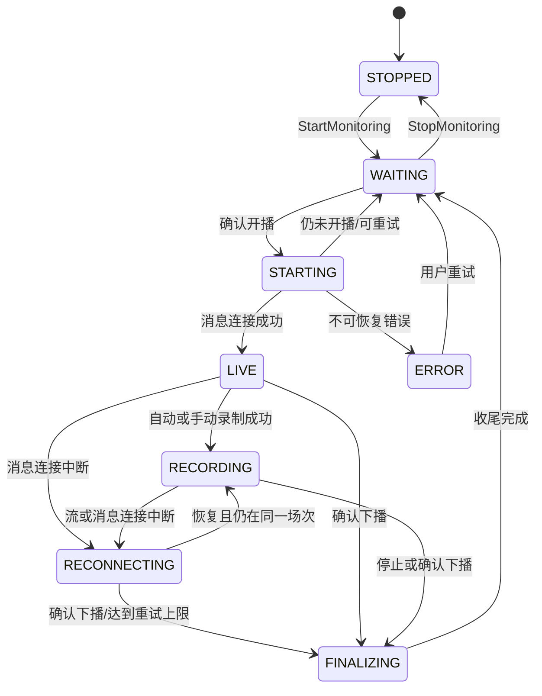

# 直播采集与录制开发计划

> 上级计划：[总开发计划](00-master-development-plan.md)
> 相关计划：[桌面 UI](01-desktop-ui-development-plan.md) · [数据与分析](03-data-and-analysis-development-plan.md) · [工程与发布](04-engineering-testing-and-release-plan.md)
> 实施状态（2026-07-19）：P3-CAP-001、P3-EVT-001、P3-REC-001、P3-MEDIA-001、P3-RCV-001 已完成；PHASE-3 已完成 26/30 点（87%），当前进入 P3-UI-001。
> 最近验收：[P3-RCV 异常恢复](validation/2026-07-19-p3-rcv-recovery.md)

## 1. 目标

本计划定义从“等待开播”到“场次完成”的完整采集链路：直接复用现有 `douyinLive` Go 核心，解析可录制直播流，管理 FFmpeg 分片，持久化互动事件，维护统一时间轴，并对所有已知中断形成可审计缺口。

首版成功标准不是“永不掉线”，而是“长期运行时状态可知、失败可恢复、数据缺口可见、退出可收尾”。

## 2. 现有能力复用与改动边界

### 2.1 直接复用

- `NewDouyinLiveWithSlog` / TikHub 构造器。
- `PrepareWebSocketContext`、`IsKnownOfflineStatus`、`Start`、`Close`、`Dispose`。
- `SubscribeMessage`、`Unsubscribe` 和 `LiveMessage.ReceivedAt`。
- 直播页与 `web/enter` 请求、Cookie、签名、重连和保活。
- 已有消息类型常量和 protobuf 解析。

### 2.2 对根库的最小新增公共能力

当前 `fetchRoomEnterData` 是非导出方法，桌面应用不能安全取得直播流。根包新增只用于业务集成的解析接口：

```go
type ResolvedStream struct {
    ID         string
    Protocol   string // "flv" | "hls"
    QualityKey string
    Quality    string
    Codec      string // "h264" | "h265" | "unknown"
    Bitrate    int64
    URL        string // 仅 Go 内部使用，禁止日志与 Wails 序列化
    SourcePath string
}

func (dl *DouyinLive) ResolveStreams() ([]ResolvedStream, error)
```

规则：

- 方法复用同一实例的 Cookie、签名和 HTTP 上下文，不另建不一致的抓取实现。
- 返回切片是当前时刻快照，调用方必须假定 URL 会过期。
- `ResolvedStream` 不作为 Wails 绑定类型；前端使用去掉 `URL`、`SourcePath` 的 `StreamVariant`。
- 解析函数拆为纯函数 `parseResolvedStreams(body string)`，使用脱敏 fixture 测试。
- 不改变现有构造器、订阅接口和 `cmd/main` 输出格式。

P3-REC 已增加 `StreamSelectionPreference`、`RankResolvedStreams` 和 `NormalizeStreamQualityPreference`。排序返回独立副本；`URL` 仅供录制器进程参数使用，`URL` 与 `SourcePath` 均从 JSON、fmt/GoString 和结构化日志表面隐藏。

## 3. 模块设计

```text
internal/room/
  supervisor.go              # 房间长期状态机
internal/capture/
  session.go                 # 场次生命周期
  stream_resolver.go         # 选择与刷新
  recorder.go                # FFmpeg 进程
  segment_probe.go           # ffprobe 校验
  recording_root.go          # 外部录制根、标记和耐久身份
  media_contracts.go         # attempt/分片/产物快照契约
  media_repository.go        # Schema v4 媒体 CAS 仓储
  media_scan.go              # 有界发现 partial/final 分片
  media_segment_finalize.go  # 探测、哈希、原子转正和审计
  media_artifact.go          # WAV/MP4 代理生成
  media_artifact_probe.go    # 代理格式与活动包验收
  media_finalizer.go         # 场次媒体两阶段收尾与重入截止时间
  process_recovery.go        # 耐久 attempt 对应 Job 进程证据恢复
  recorder_recovery.go       # 运行期录制异常退避、代际隔离与缺口
  recorder_recovery_sqlite.go # 运行期恢复的 SQLite 缺口仓储
  media_recovery.go          # open/finalizing 媒体恢复与现场保留
  recovery_contracts.go      # 启动恢复分页、原子终态与稳定错误契约
  recovery_repository.go     # Schema v5 keyset 查询与 RecoverAndClose
  recovery.go                # 进程→媒体→事件→场次的启动恢复协调
  media_manifest.go          # media.json 耐久投影
internal/app/
  infrastructure_lease*.go  # 数据根级 Windows 全局实例租约
internal/eventstore/
  contracts.go               # 事件、checkpoint、缺口和礼物折叠契约
  queue.go                   # 单一有序、条数与字节双有界队列
  binpack.go                 # 原始载荷帧、压缩和 CRC32C
  spool.go                   # raw binpack + 元数据 WAL 耐久屏障
  normalizer.go              # protobuf -> 白名单标准事件
  privacy.go                 # HMAC 身份与内容隐私边界
  dedupe.go                  # 容量和 TTL 有界的短窗去重
  gift_combo.go              # 礼物连击折叠
  writer.go                  # SQLite 原子批写与 checkpoint CAS
  manager.go                 # 场次事件写入器生命周期
  recovery.go                # 耐久尾重放、权威截止刷新与 checkpoint/fold 关闭
  sink.go                    # EventSink 接纳、排空和关闭
```

每个房间由一个 `RoomSupervisor` 串行处理状态变化。直播连接、录制进程和事件写入可以并发，但只能通过监督器发出状态转换，避免两个 goroutine 同时创建场次或启动 FFmpeg。

## 4. 状态机

### 4.1 房间状态



### 4.2 转换约束

- `STARTING` 必须生成单次操作 ID，过期结果不得覆盖较新的状态。
- 只有收到可靠在线状态并成功建立直播上下文后才能创建 `LiveSession`。
- 消息连接成功但无可录制流时允许进入 `LIVE`，场次记录 `recording_status=unavailable`。
- 下播需要现有核心的连续状态确认；单次网络错误不能结束场次。
- `FINALIZING` 期间禁止创建同房间新场次；收尾超时则标记 `incomplete` 后返回 `WAITING`。
- 用户停止监控时，正在录制的场次仍先进入 `FINALIZING`，不能直接杀进程并丢弃清单。

### 4.3 场次持久化契约（Schema v2）

- `live_sessions.status` 继续使用 `starting/recording/finalizing/completed/interrupted/failed`；为避免重建被事件、媒体、转写、分析和缺口表共同引用的父表，v2 不改变原 CHECK。活动消息场次使用 `status=recording`，不等同于媒体一定正在写入。
- 新增 `recording_status`：`pending/disabled/starting/recording/unavailable/reconnecting/finalizing/completed/incomplete/failed`。关闭录制策略时为 `disabled`；消息连接有效但无可录制流或依赖不可用时为 `unavailable`，不得因此停止事件场次。
- 新增非敏感 `operation_id`。Open、Rebind、Finalize 每次生成新 ID；仓储更新同时 CAS 旧场次状态、旧录制状态和旧 operation ID，旧异步结果影响行数为 0 时返回稳定的过期操作错误。
- 建立 `status IN ('starting','recording','finalizing')` 的按房间部分唯一索引，作为单 worker 串行编排之外的数据库最终防线。`FINALIZING` 完成前不得为同一房间创建新场次。
- 场次路径固定为 `rooms/<room-config-id>/sessions/<yyyy>/<mm>/<session-id>`，数据库只保存相对数据根的 `/` 分隔路径。每次创建和状态转换都以临时文件、同步和同目录原子重命名更新 `session.json`；数据库是索引事实来源，文件镜像用于数据库损坏时重建。
- `manifest_dirty` 与场次主事务一同置为 1。文件成功落盘后必须先把脱敏 `CAPTURE_MANIFEST_REPAIR_CLEARED` 健康事件写入 JSONL 并完成 Sync，再以 `id + operation_id + status + recording_status + updated_at` 精确 CAS 清零；任何日志同步、清标或进程崩溃都保留脏标记，启动时按 128 条 keyset 分页只扫描脏记录和活动场次。
- 同一场次的读取修复、创建后提升和状态转换共用串行锁，并在写文件前重读数据库版本；`updated_at` 严格单调，避免旧 repair 或同毫秒转换覆盖新 manifest。批量启动修复每页只做一次健康日志 Sync，未清数量必须准确递减到 0。
- `RoomSupervisor` 仍是唯一房间状态机；`CaptureCoordinator` 只返回由 worker 持有的场次句柄并组合 Recorder/EventSink。外层连接中断进入 `RECONNECTING` 时保留句柄；下一次可靠在线执行 Rebind 并复用同一 `session_id`，只有确认下播、用户停止或应用退出才 Finalize。
- MonitorManager 与 Application 关闭均采用调用方无关的共享清理：调用方 context 只限制等待，不拥有清理；Application 进入 `STOPPING` 后立即摘除公共服务但保留原生命周期，等 Monitor/场次真正排空后再取消 context、关闭 SQLite 与日志。初始化在开始和提交两个位置拒绝 `STOPPING/STOPPED`，禁止超时关闭后的资源复活。

### 4.4 事件持久化契约（Schema v3）

- `live_events` 新增 `ingest_sequence`、`event_role`、`normalizer_version` 和 `parse_error_code`。新采集的 source 事件按场次从 1 严格递增且唯一；aggregate 是从 source 派生的耐久事件，可以引用相同序列但不能冒充 source。
- `event_ingest_checkpoints` 保存最后完整提交的序列、raw/WAL 字节位置、`open/closing/closed/degraded` 状态和不可变 `privacy_key_id`。正序状态转换和 closed 后不可变由数据库触发器兜底。
- 每个批次把 source/aggregate 事件、`gift_combo_states`、`capture_gaps` 与 checkpoint 放在同一 SQLite 事务中，并以旧 checkpoint 序列作为 CAS 前置条件；事务失败不得单独推进序列或派生状态。
- `gift_combo_states` 按场次与 combo key 唯一保存 open/closed 折叠。closed 行及其 aggregate 引用不可重开或改写，重启和重复 source 不能生成第二条聚合。
- `capture_gaps` 增加 `event_persistence` 类型和场次内唯一 `dedupe_key`，用于幂等记录本地拒绝、spool 或数据库持久化缺口。
- 事件先完成 raw binpack Sync，再完成引用该 raw 帧的 WAL Sync，最后才允许 SQLite checkpoint 前进。恢复只从 checkpoint 之后按批读取，禁止全场载入内存或 source-only 提前确认。

### 4.5 媒体持久化契约（Schema v4）

- `recording_roots` 把外部绝对目录、规范路径摘要、卷身份摘要和目录内标记绑定为耐久 root ID；标记先于数据库提交，重试可幂等收敛。内部媒体根不建外部 root 行。
- `session_media` 以场次为主键，保存不可变 `root_id + relative_path`、`open/finalizing/completed/incomplete` 状态、独立 manifest revision/dirty、媒体时钟和 URL/路径均已剔除的 attempt 列表。
- 每个 attempt 在启动 FFmpeg 前先耐久追加；收到真实启动活动后单调转为 `committed`，优雅停止后单调转为 `clean`。任何 journal 失败都禁止或停止对应进程，不能留下无来源媒体。
- `media_segments` 保存 attempt 来源、最终/源相对路径、探测版本、SHA-256 和 `partial/complete/recovered/corrupt/missing` 状态；`media_artifacts` 独立保存 ASR WAV 与播放 MP4 的来源哈希、产物哈希和状态。
- SQLite 是媒体事实来源；`manifests/media.json` 是按 revision 排序、原子替换的可修复投影。只有文件落盘并通过同 revision CAS 后才清除 `manifest_dirty`。
- 每场次最多 128 个 attempts、4,096 个分片和 8,192 个产物；仓储按最大值加一读取，并在事务内按 upsert 后耐久并集计数，超限时整笔回滚。

### 4.6 启动恢复索引与终态契约（Schema v5）

- `idx_live_sessions_recovery_page` 以 `(id, created_at)` 覆盖 `starting/recording/finalizing` 场次；每次启动固定一个 `scan_cutoff`，再以 UUIDv7 `id` 严格递增 keyset 分页，避免修复中新增或变更的行导致跳页、重复或无限扫描。
- `idx_session_media_recovery_page` 以 `(state, session_id)` 覆盖 `open/finalizing` 媒体。恢复器只消费耐久 attempt、segment、artifact 和 manifest 状态，不从文件名猜测进程归属或完成状态。
- `RecoverAndClose` 在一个 SQLite 事务内幂等写入恢复缺口、关闭所有旧 open gap，并把旧活动场次推进为 `interrupted` 与确定的录制终态；旧状态、旧 recording 状态、旧 operation ID 和扫描截止时间共同防止恢复覆盖新操作。
- v4→v5 先创建可打开备份，再在单一迁移事务中创建两个部分索引；DDL 或后续校验失败时索引和 schema version 一并回滚。

## 5. 流地址解析

### 5.1 候选字段顺序

解析器以容错方式遍历以下来源，不依赖数组固定索引：

1. `data.data[*].stream_url.flv_pull_url`
2. `data.data[*].stream_url.hls_pull_url_map`
3. `data.data[*].stream_url.hls_pull_url`
4. `data.data[*].stream_url.live_core_sdk_data.pull_data.stream_data`
5. `data.data[*].stream_url.pull_datas`
6. `data.data[*].additional_stream_url` 中对应字段
7. 顶层 `data.web_stream_url` 作为最后兜底

嵌套 JSON 字符串先执行严格 JSON 解码；解码失败记录字段路径和长度，不记录内容。未知字段忽略但保留 fixture 用于后续适配。

### 5.2 标准化

- 协议从字段来源和 URL scheme/path 双重判断。
- 清晰度 key 转为稳定标签：原画、蓝光、超清、高清、标清；无法识别则保留 `unknown:<key>`。
- 编码优先读取 SDK 元数据，其次从参数推断；不能确认时为 `unknown`。
- 使用规范化 URL 的非敏感部分生成候选 ID；禁止把 query 写入 ID、日志或数据库。
- 完全相同的协议、质量、编码和主机路径候选去重。

### 5.3 自动选择规则

用户设置包含 `quality_preference`、`protocol_preference` 和 `compatibility_mode`。

自动模式按以下顺序评分：

1. 满足用户指定质量；未指定则选择最高可用质量。
2. 兼容模式优先 H.264；只有 H.265 时允许录制但标记回放可能需转码。
3. 同质量下优先 FLV，失败后降级 HLS；用户明确指定协议时先尊重指定值。
4. 同一候选存在码率时选择最高正码率；未知码率排在已知码率之后。
5. 启动失败按评分依次尝试候选，每个候选最多一次，全部失败后重新解析而不是无限轮询旧 URL。

选择结果写入媒体清单，但只保存协议、质量、编码、码率和脱敏源标识，不保存完整 URL。

P3-REC 已实现确定性稳定排序、质量词汇归一化、默认 H.264/FLV 优先、指定协议优先、已知正码率优先和无效 URL 过滤。每个快照内相同完整 URL 只尝试一次；重新解析得到的新签名 URL 可再次尝试。

## 6. FFmpeg 进程管理

### 6.1 依赖发现

查找顺序：

1. 应用设置中的明确路径。
2. 安装包随附的受信任 `ffmpeg.exe` 和 `ffprobe.exe`。
3. 系统 `PATH`。

发现后对成对工具执行有界 `-version` 校验，只记录脱敏版本/构建摘要和可执行文件 SHA-256。找不到或无法校验 FFmpeg 时消息监听仍可用，录制能力以稳定错误码标记不可用。

### 6.2 启动安全

- 使用私有生命周期 context 的 `exec.CommandContext` 和独立参数数组，绝不调用 `cmd /c` 或拼接 Shell 字符串；调用方 context 只限制启动/等待，不拥有已启动进程。
- 流 URL 只作为进程参数存在；日志显示 `<redacted-stream-url>`。
- Windows 下严格按 `CREATE_SUSPENDED`→Assign Job Object→`NtResumeProcess` 启动；任一步失败都先终止进程再返回，避免子进程逃逸。
- `-progress pipe:1` 使用 16 KiB 有界解析器，只有 `progress=continue` 表示启动成功；标准错误只保留 64 KiB 脱敏尾部摘要。
- 每个启动分配 UUIDv7 `recorder_attempt_id` 和独占 `.attempt-*` 目录；退出回调必须匹配当前 attempt 才能改变状态。
- 每个进程只有一个 `Wait` owner，stdout/stderr 排空完成后才释放并发容量；调用方取消不会提前释放仍在运行的 FFmpeg。

### 6.3 工作格式与分片

- 默认 `-c copy`，不在录制阶段重新编码。
- 工作容器为 MKV，默认每 600 秒一个分片；设置允许 300–1800 秒。
- 文件名包含序号、UTC 纳秒和 attempt 标识，先写入独占 attempt 目录中的 `.mkv.partial`；不得复用目录或覆盖已有分片。
- P3-MEDIA 已实现 metadata + 首个目标媒体包的两阶段 ffprobe；两个阶段共享 10 秒超时与 1 MiB 输出预算，只有 Matroska 中存在音/视频包且有正时长或正时间范围才可读，只有流头的空壳文件不会转正。
- 可读 partial 在探测前后完成同一文件身份、大小与 SHA-256 校验，随后耐久同步并以不覆盖既有目标的原子操作发布为 `.mkv`。同内容重复发布幂等收敛，异内容冲突持久化为 corrupt 并保留现场。
- H.264 + 可选 AAC 组合无损封装为 MP4；其他含视频组合保留 MKV 并登记 `pending_transcode`。含音频分片生成单声道 16 kHz `pcm_s16le` WAV 供 ASR；无对应流则登记 `not_applicable`。
- WAV/MP4 代理先写唯一 partial，再原子发布，并再次用 metadata + 首个目标流媒体包验收；零包空壳、错误编码、发布冲突、生成后替换或删除均不能成为 `complete`。
- 代理失败不把已验证原始分片降级为失败；错误以稳定状态和 warning 保留，可重试失败/缺失产物，并可收养“文件已发布但数据库提交前崩溃”的同源合法产物。
- 每个分片记录容器、流、时长、首末时间戳、大小、SHA-256、attempt 来源和探测版本；已完成原始媒体或代理在后续收尾中发现缺失、替换、目录、符号链接、junction/reparse 时持久化为 missing/changed，且保留原证据。

### 6.4 停止顺序

1. 监督器标记 `FINALIZING`，停止接受新的录制启动。
2. 请求 FFmpeg 优雅结束并等待当前容器写尾。
3. 5 秒无响应时终止 Job Object 进程树；再等 3 秒，仍未退出时终止根进程并关闭句柄，把分片留给恢复流程。
4. 探测全部分片、补全媒体清单、计算 SHA-256（可后台低优先级完成）。
5. 解除事件订阅并等待在途 `Accept` 返回，关闭有界队列；排空 source、关闭所有 open 礼物折叠，依次提交 `closing` checkpoint、关闭并同步 spool、提交 `closed` checkpoint。
6. 更新场次完整性、触发基础聚合和 UI 完成事件。

P3-REC 已实现步骤 2–3 的进程边界，P3-MEDIA 已实现步骤 4 的媒体收尾，P3-EVT 已实现步骤 5 的正常事件耐久关闭，P3-RCV 已补齐异常重启、缺口编排、事件恢复关闭与旧场次终态推进。调用方超时只停止等待，Recorder/EventSink 的共享完成仍保有唯一清理 owner；应用在活动清理归零且实例租约释放前不会关闭或复用 SQLite。

## 7. 录制恢复策略

### 7.1 失败分类

| 类别 | 示例 | 行为 |
| --- | --- | --- |
| 输入过期 | 403、404、立即 EOF | 重新解析流，1/2/5/10 秒退避 |
| 临时网络 | 超时、连接重置 | 先重试当前候选，再重新解析 |
| 不支持编码/容器 | FFmpeg 明确报错 | 尝试下一候选或兼容容器 |
| 本地资源 | 磁盘不足、无权限 | 停止录制，保持低成本监听并告警 |
| 依赖缺失 | 可执行文件不存在/损坏 | 禁止自动重试，要求用户修复 |
| 已下播 | 状态连续确认 | 进入 `FINALIZING` |

同一场次自动重启最多 10 次；连续失败窗口超过 5 分钟或重启达到上限后停止录制但继续消息监听。每次失败和恢复之间建立 `capture_gaps`。

P3-REC 已实现启动早退分类、同一快照候选逐一回退，以及本地资源/依赖错误 fail-fast。P3-RCV 已实现 1/2/5/10 秒退避（10 秒封顶并重复）、单个恢复代最多 10 次或 5 分钟、`recording_restart` 缺口开闭、恢复代际 fencing 和旧异步结果隔离。重试成功回到 `recording`；达到上限后稳定落为 `RECORDING_RETRY_EXHAUSTED`，停止录制但不终止消息场次。

### 7.2 应用启动恢复

1. `PrepareLayout` 完成后、创建日志/SQLite/凭据和启动 Monitor 之前，应用按规范数据根摘要获取 `Global\DouyinLive.Infrastructure.<sha256>` 实例租约。同一数据根的第二实例稳定返回 `APPLICATION_INSTANCE_ACTIVE`；持有进程退出或崩溃后由内核释放句柄。
2. 启动时固定 UTC `scan_cutoff`，以最多 128 条的 UUIDv7 严格 keyset 页扫描 `STARTING/RECORDING/FINALIZING`。页内 ID、全局顺序、页长和 `NextID` 任一不合约都在副作用前 fail closed；新增行不进入本轮快照。
3. 对每个非 disabled 场次，先从 URL-free attempt journal 重建 `Global\DouyinLive.Recorder.v1.<root-hash>.<attempt-id>` 名称并重新打开 Job Object。Job 不存在表示该 attempt 无遗留进程；存在进程则终止整棵 Job 树。打开/查询/终止/关闭失败、歧义 LastError、畸形返回或不支持的平台均拒绝继续媒体变更。
4. 进程证据安全后，恢复 `open/finalizing` 媒体：用既有 finalizer 探测 partial/final 与代理，合法分片登记为 `recovered`，损坏/重复/冲突/orphan 原样保留并审计，绝不删除原始现场。open 恢复的关闭时间首次确定后保持稳定，关闭失败仍保留 finalizing 供下次重入。
5. 事件管理器从 checkpoint 后重放 durable tail，关闭 open gift folds，并把 checkpoint 推进 `closing→closed`。缺失 checkpoint 时仍查询耐久事件/礼物及 eventstore 自有的 `kind=event_persistence + reason_code=EVENT_DROPPED_LOCAL` gap；capture 启动恢复写入的 gap 明确排除，避免恢复器制造自己的 durable evidence。无证据才幂等成功，有证据则返回权威最大截止与永久 `EVENT_RECOVERY_CUTOFF_INVALID`。closed checkpoint 还要求 source 事件的最大正 `ingest_sequence` 不超过 `committed_sequence`；aggregate 不参与该序列校验，open fold 仍必须为空。若一个前缀已提交后才发现永久损坏，同样刷新上述权威最大时间；任一权威读取失败均分类为 `EVENT_RECOVERY_DEFERRED`，保留活动场次并让应用启动 fail closed，禁止用较旧媒体时间终态化。
6. 取场次开始、媒体、已提交事件/礼物的最大可信时间作为截止；未来时间或墙钟倒退增加 `clock_uncertain`。恢复事务幂等关闭旧 open gaps，写入 `process_crash`/`message_disconnect`、必要的 `event_persistence` 与 `clock_uncertain` 缺口，再把旧场次原子推进为 `interrupted`。
7. 只有全部旧场次完成终态化后才启动 Monitor。任何 process recovery、deferred event recovery、纯 `STARTUP_RECOVERY_INCOMPLETE` 或未知错误均在应用边界 fail closed，不能先发布 Ready。房间随后仍在线时由正常监督器创建新 `session_id`，不复用旧场次。

启动恢复事件只输出经 UUIDv7 校验的场次/房间关联 ID；损坏值统一替换为 `invalid`。details 仅包含计数、稳定错误码和布尔状态，不含流 URL、绝对路径、Job 原生错误或隐私字段。

## 8. 场次目录与清单

```text
data/
└── rooms/<room-config-id>/sessions/<yyyy>/<mm>/<session-id>/
    ├── session.json
    ├── events/
    │   └── spool/
    │       ├── raw-<utc-hour>-<index>.binpack
    │       └── wal-<utc-hour>-<index>.wal
    ├── media/
    │   ├── .attempt-<uuidv7>/
    │   │   └── segment-<index>-<utc>-<attempt>.mkv.partial
    │   ├── segment-000001-<utc>.mkv
    │   └── playback-000001.mp4
    ├── audio/
    │   └── asr-000001.wav
    ├── manifests/
    │   ├── media.json
    │   └── gaps.json
    └── reports/
```

`session.json` 只保存非敏感元数据和 schema 版本，可在数据库损坏时重建索引。所有路径在数据库中保存为相对数据根目录的 `/` 分隔路径；操作系统访问时统一由路径服务转换和校验。

P3-MEDIA 已启用外部 `RecordingDirectory`，但只把媒体相关目录迁出数据根：

- 内部根使用 `session_media.root_id = NULL`，`relative_path` 保持 `rooms/<room-config-id>/sessions/...`，媒体与 `session.json`、事件 spool 位于同一数据根场次树。
- 外部根先注册为 `recording_roots`，媒体相对路径为 `<room-config-id>/sessions/...`；数据库、配置、日志、`session.json` 和事件 spool 仍留在数据根，外部根只承载 `.douyinlive-recording-root.json`、`media/`、`audio/` 与 `manifests/media.json`。
- 注册要求既有绝对目录通过可写、Sync、原子改名、规范路径和卷身份校验。marker 仅含版本、root ID 与卷身份，不含绝对路径；marker、SQLite 行、规范路径或卷身份任一漂移即 fail closed。
- Windows 路径逐组件拒绝符号链接、junction/reparse、保留设备名、尾随点/空格及大小写别名；验证发生在扫描、探测返回、发布和数据库提交前，非法组件不会先在根外创建目录。
- 场次位置一经建立不可修改；若需更换录制根，只影响之后创建的新场次，不迁移活动媒体。

## 9. 事件采集

### 9.1 回调约束

`SubscribeMessage` 回调只执行：

1. 使用上游分发前已经捕获的 `ReceivedAt`，复制方法、房间元数据和原始 payload；每个订阅者取得独立副本，不能被旧回调修改。
2. 分配场次内严格递增序列和事件 ID，生成内部 `IngestEnvelope`。
3. 先尝试普通接纳额度，额度耗尽时使用紧急预留；两者共享同一个 FIFO，紧急预留不能让后来的事件超车。
4. 两类额度都耗尽或载荷超过上限时累计 `EVENT_DROPPED_LOCAL`，以稳定 dedupe key 物化为 `event_persistence` 缺口并发出严重告警。

回调中禁止数据库查询、文件 Sync、FFmpeg 调用、网络请求和分析。Finalize 先注销订阅，再等待所有已进入的回调完成接纳，之后才允许关闭队列和 spool，避免关闭竞态丢失已分发消息。

### 9.2 标准化与原始数据

- `LiveEvent` 保存常用字段；原始 protobuf 保存到按块压缩的 binpack，并通过 offset/length 引用。
- raw 帧包含版本、长度和 CRC32C；载荷超过压缩阈值且压缩后更小时使用单并发 zstd。WAL 只保存 envelope 元数据和 raw 引用，不复制原始 payload。
- 每批必须按 raw flush/Sync → WAL flush/Sync 的顺序建立耐久屏障。WAL 不能引用尚未 Sync 的 raw 字节；SQLite 不能引用尚未 Sync 的 WAL 位置。
- protobuf 解析失败或未知 method 仍保存原始数据和失败原因。
- 用户标识进入标准表前使用安装级盐进行 HMAC-SHA256；昵称作为可配置隐私字段。
- 内容字段做长度上限和 UTF-8 修复，原始载荷不修改。

### 9.3 去重与礼物连击

- 优先使用平台 message ID 去重。
- 无 ID 时使用 `room_id + method + platform_time + payload_hash`，只在短时间窗口去重。
- 去重缓存有容量和 TTL 上限，数据库对 `(session_id, dedupe_key)` 建唯一约束作为最后防线。
- 礼物连击按平台 `group_id`/重复 ID/结束标志维护聚合；source 原始消息全部保留，closed 时另写一条 aggregate 标准事件。
- 折叠只加载当前批触及的 open 状态；空闲和收尾关闭按固定页大小扫描，不能把全场 open/closed combo 常驻内存。closed 状态由数据库记录并保持不可变，重启后的迟到消息只能被幂等忽略。

### 9.4 批写、降级与恢复

- 默认每 250 条或 500 ms 形成一批；队列、spool、标准化和 SQLite 各自保持相同 source 顺序。
- SQLite 事务同时提交 source/aggregate 事件、礼物折叠、持久化缺口和 checkpoint。checkpoint 的 `PreviousSequence` 不匹配时整批失败，不做部分成功。
- `SQLITE_BUSY` 在 5 秒窗口内指数退避。超过窗口或遇到可恢复数据库错误后进入 `degraded`，继续把事件追加到有界 spool，但 checkpoint 停留在最后完整事务。
- 降级恢复和进程重启都只从 checkpoint 后的 WAL 位置按批重放；每批重新标准化、查询触及的去重键和礼物状态并原子提交，内存占用不随场次总事件数增长。
- WAL/raw 的截断尾帧按 CRC 和长度修复到最后有效边界；中段损坏、路径越界、privacy key 不一致或 spool 超限属于 fail-closed 错误，不静默跨过。
- checkpoint 关闭顺序为 `open/degraded → closing → closed`。关闭调用超时只停止调用方等待，后台继续同一排空；Application 必须在所有 EventSink 完成后才关闭 SQLite。

## 10. 时间轴与缺口

- `received_at` 使用 UTC 墙钟；同时在进程内捕获单调时间用于偏移计算。
- `message_create_at` 仅在字段存在、单位可识别且不偏离接收时间超过合理阈值时标记可信。
- `session_offset_ms` 默认基于场次媒体基准；无媒体时基于确认开播时间并标记 `clock_source=received`。
- 分片记录 FFmpeg 启动墙钟、首 PTS、末 PTS 和探测时长。
- 可选校准标记通过固定弹幕与 ASR 短语估算 `capture_offset_ms`，只作为后处理校准，不覆盖原始时间。

缺口类型：`message_disconnect`、`recording_restart`、`stream_unavailable`、`disk_full`、`process_crash`、`clock_uncertain`。缺口必须有开始、结束、来源、严重度和是否恢复；开放缺口在收尾时关闭或标记未知结束。

## 11. 资源与并发控制

- 默认最多 8 个等待/消息监听房间、1 个录制房间、1 个 ASR/分析任务。
- 录制器工厂默认并发 1、允许 1–4；超过 1 时显示磁盘带宽和空间风险。
- 事件通道、FFmpeg 日志、UI 批次和分析队列全部有界。
- 录制额度只在进程 Wait、stdout/stderr 排空和 watcher 完成后释放；构造或 Stop 的调用方超时也不得提前复用。
- 每房间一个根 context；场次、录制器和写入器为子 context。
- 停止顺序由监督器统一管理，任何子组件不得关闭不属于自己的通道。
- 默认普通接纳为 4,096 条/32 MiB，紧急预留为 512 条/8 MiB；共享总上限为 4,608 条/128 MiB，单 payload 上限 4 MiB。预留只影响接纳，不改变 FIFO 顺序。
- 每场次 raw+WAL spool 默认总上限 4 GiB，启动时发现的既有分片也计入同一预算；零值配置选择该默认值而不是无限制。
- 礼物折叠、恢复重放和数据库查询均按批次/页大小限制；不得以 deferred map、全量 replay 或保留全部 closed combo 的方式换取恢复便利。
- 单个解析快照最多接受 4,096 个候选进入排序，并只尝试排序后的前 64 个；先排序后截断，不能让无效低优先级候选挤掉合法高优先级候选。
- 每场次媒体上限为 128 attempts、4,096 segments、8,192 artifacts；目录扫描、SQLite 查询、事务 upsert 并集和 manifest 编码都独立实施上限。
- `media.json` 最大 128 MiB，相对路径最大 2,048 字节；最大合法 cardinality/路径宽度有真实编码测试，超限不写文件、不推进 revision。
- 启动恢复每页最多 128 个场次，并在副作用前验证整页契约；单场次恢复缺口最多 32 条、details JSON 最多 64 KiB。
- 同一数据根仅允许一个应用基础设施 owner；租约先于 SQLite 打开，释放晚于所有共享清理，避免两个实例同时恢复或录制。

## 12. 测试计划

### 12.1 解析器

- 覆盖 `doRequest.example.json` 中各类 FLV/HLS、SDK 嵌套 JSON、附加流和空流。
- 字段缺失、类型变化、无效 JSON、重复候选、H.265-only 和未知质量。
- fixture 必须脱敏 query；测试断言不得输出完整 URL。

### 12.2 状态机

- 未开播 → 开播 → 录制 → 下播 → 等待。
- 连接中断但仍开播、重复在线通知、启动结果过期和用户并发点击。
- 停止监控、退出程序、收尾超时和启动恢复。
- 用模型/表驱动测试验证不存在非法转换和双场次。

### 12.3 事件持久化

- Schema v2→v3 备份、旧事件/缺口保留、约束触发器和迁移失败全回滚。
- 队列条数/字节/单载荷边界、普通与紧急接纳共享 FIFO、深拷贝所有权、关闭和在途接纳竞态。
- raw/WAL CRC、压缩、截断修复、轮转、Sync 顺序、总容量边界以及重启后既有分片计费。
- SQLite 批次原子性、checkpoint CAS、重复 source、closed checkpoint/combo 不可变、数据库忙/满/损坏和降级尾部重放。
- allowlist 标准化、未知/失败事件、HMAC 身份、昵称策略、短窗去重、礼物结束/空闲关闭和重启迟到消息。
- 高基数礼物、长时间数据库降级和连续本地拒绝测试必须证明内存及耐久辅助状态保持有界。

### 12.4 FFmpeg 与恢复

- 使用本地生成的短测试流验证分片、优雅停止、探测和封装。
- 注入 403、EOF、进程崩溃、磁盘写失败和 ffprobe 失败。
- 校验进程参数脱敏、Job Object 清理和 `.partial` 恢复。
- 10 分钟稳定性测试统计 goroutine、句柄、内存、分片连续性和事件延迟。

P3-MEDIA 已在 FFmpeg 8.1.2 真实工具链完成以下链路：

- 生产 RecorderFactory→FFmpeg→Stop→SQLite/`media.json`→最终 MKV→16 kHz 单声道 WAV→H.264/AAC MP4，并分别覆盖内部根与外部注册根。
- 可读 Matroska、空 Matroska、活跃/空壳 WAV/MP4、声明音轨但目标音频零包等两阶段探测边界；零包产物保持非 Complete。
- 原始分片与代理的缺失、内容替换、同 stat 替换、探测/生成期间 TOCTOU、目录、符号链接和 Windows junction/reparse；既有证据保留且状态精确降级。
- manifest CAS、发布后数据库提交前崩溃收养、重复收尾、外部 root 漂移、路径别名、最大 cardinality、最大 manifest 及超限事务回滚。

P3-RCV 已完成并自动化覆盖：

- 1/2/5/10 秒退避、10 次/5 分钟上限、重试成功/耗尽、代际 fencing、持久化失败及 `recording_restart` gap 幂等开闭。
- Schema v4→v5 备份/回滚、固定截止 keyset 多页、无序/回退/错误 cursor/非法 UUID/超限页在副作用前 fail closed。
- Windows 全局实例租约的独立子进程重复拒绝与 holder 崩溃释放；Global Recorder Job 的独立子进程重开、重复 admission 拒绝、歧义 LastError 句柄单次关闭、关闭失败稳定 cleanup 分类与隐私屏蔽。
- 进程→媒体→事件→场次顺序，open/finalizing 媒体重入、partial/orphan/conflict 保留、无 checkpoint 的耐久证据审计、事件 durable prefix 截止刷新、deferred 不终态化、closed checkpoint 残留 open fold 拒绝，以及 gap/场次事务回滚。
- Reporter 关联 ID、错误摘要、Job 名和恢复 details 的脱敏边界；应用对 process、deferred、incomplete 与未知恢复错误统一 fail closed。

全量 Go test/vet/build、event source-tail/local-drop-gap 与关键恢复/跨进程测试 20 轮、前端 typecheck/Vitest/build、Wails 生产构建和 diff 门禁通过，独立终审 P0/P1/P2=0。上述恢复合同不依赖在线直播状态，因此 P3-RCV 无需使用直播间冒充验收；在线 10 分钟、真实断网、FFmpeg 崩溃和真实下播收尾仍由 P3-ACC 统一验收。

### 12.5 验收

- 开播后在目标时间内建立消息连接并开始录制。
- 网络恢复后自动创建新分片并记录准确缺口。
- 下播后数据库、`session.json`、媒体清单和 UI 状态一致。
- 任何失败均不导致 Cookie 或完整流 URL进入日志、UI或诊断包。
- 原有 Go 单元测试和 `cmd/main` WebSocket 冒烟测试继续通过。
